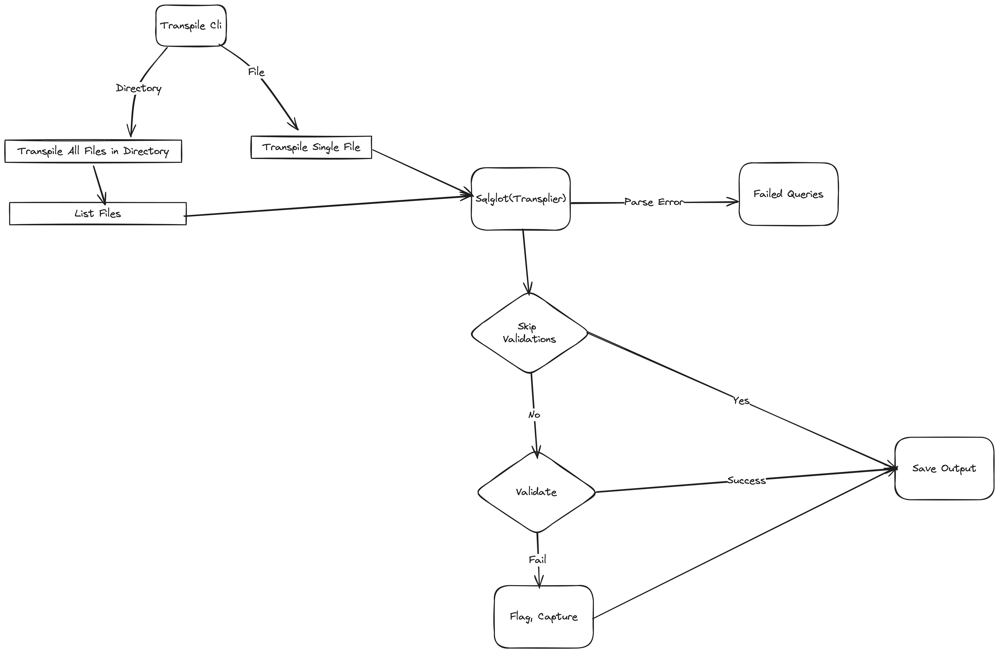

# 

-----

# Table of Contents

1. [Introduction](#introduction)
   - [Transpile](#transpile)
2. [Environment Setup](#environmentsetup)
3. [How to use Transpile](#howtouse)
4. [Project Support](#projectsupport)

----
# <span style="color: #FF5733;" id="introduction"> Introduction </span>
## <span style="color: #007ACC;" id="transpile"> Transpile </span>
Transpile is a self-contained SQL parser, transpiler, and validator designed to interpret a diverse range of SQL inputs and generate syntactically and semantically correct SQL in the Databricks SQL dialect. This tool serves as an automated solution, named Transpile, specifically crafted for migrating and translating SQL scripts from various sources to the Databricks SQL format. Currently, it exclusively supports Snowflake as a source platform, leveraging the open-source SQLglot.

Transpile stands out as a comprehensive and versatile SQL transpiler, boasting a robust test suite to ensure reliability. Developed entirely in Python, it not only demonstrates high performance but also highlights syntax errors and provides warnings or raises alerts for dialect incompatibilities based on configurations.

#### Design Flow:


----

# <span style="color: #FF5733;" id="environmentsetup"> Environment Setup </span>

1. **<span style="color: #007ACC;">Databricks Cli - </span>** Ensure that you have the Databricks Command-Line Interface (CLI) installed on your machine. Refer to the installation instructions provided for Linux, MacOS, and Windows, available [here](https://docs.databricks.com/en/dev-tools/cli/install.html#install-or-update-the-databricks-cli).

2. **<span style="color: #007ACC;">Databricks Connect - </span>** Set up the Databricks workspace configuration file by following the instructions provided [here](https://docs.databricks.com/en/dev-tools/auth/index.html#databricks-configuration-profiles). Note that Databricks labs use 'DEFAULT' as the default profile for establishing connections to Databricks.
   
3. **<span style="color: #007ACC;">Python - </span>** Verify that your machine has Python version 3.10 or later installed to meet the required dependencies for seamless operation.
   - **Windows -** Install python from [here](https://www.python.org/downloads/). Your Windows computer will need a shell environment ([GitBash](https://www.git-scm.com/downloads) or [WSL](https://learn.microsoft.com/en-us/windows/wsl/about))
   - **MacOS/Unix -** Use [brew](https://formulae.brew.sh/formula/python@3.10) to install python in macOS/Unix machines
#### Installing Databricks CLI on macOS


#### Install Databricks CLI via curl on Windows


#### Check Python version on Windows, macOS, and Unix


----

# <span style="color: #FF5733;" id="howtouse"> How to Use Transpile </span>

## <span style="color: #007ACC;" id="install-transpile"> Step 1 : Installation </span>

Upon completing the environment setup, install Remorph by executing the following command:
```bash
databricks labs install remorph
```

Verify the successful installation by executing the provided command; confirmation of a successful installation is indicated when the displayed output aligns with the example screenshot provided:
```bash
 databricks labs remorph transpile --help
 ```


## <span style="color: #007ACC;" id="install-transpile"> Step 2 : Set Up Prerequisite File </span>
1. Transpile necessitates input in the form of either a directory containing SQL files or a single SQL file. 
2. The SQL file should encompass scripts intended for migration to Databricks SQL.

Below is the detailed explanation on the arguments required for Transpile.
- `input-sql [Required]` - The path to the SQL file or directory containing SQL files to be transpiled.
- `source [Required]` - The source platform of the SQL scripts. Currently, only Snowflake is supported.
- `output-folder [Optional]` - The path to the output folder where the transpiled SQL files will be stored. If not specified, the transpiled SQL files will be stored in the same directory as the input SQL file.
- `skip-validation [Optional]` - The default value is True. If set to False, the transpiler will validate the transpiled SQL scripts against the Databricks catalog and schema provided by user.
- `catalog-name [Optional]` - The name of the catalog in Databricks. If not specified, the default catalog `transpiler_test` will be used.
- `schema-name [Optional]` - The name of the schema in Databricks. If not specified, the default schema `convertor_test` will be used.

## <span style="color: #007ACC;" id="install-transpile"> Step 3 : Execution </span>
Execute the below command to intialize the transpile process.
```bash
 databricks labs  remorph transpile --input-sql <absolute-path> --source <snowflake> --output-folder <absolute-path> --skip-validation <True|False> --catalog-name <catalog name> --schema-name <schema name>
```

----

# <span style="color: #FF5733;" id="projectsupport"> Project Support </span>
Please note that all projects in the /databrickslabs github account are provided for your exploration only, and are not formally supported by Databricks with Service Level Agreements (SLAs).  They are provided AS-IS and we do not make any guarantees of any kind.  Please do not submit a support ticket relating to any issues arising from the use of these projects.

Any issues discovered through the use of this project should be filed as GitHub Issues on the Repo.  They will be reviewed as time permits, but there are no formal SLAs for support.
