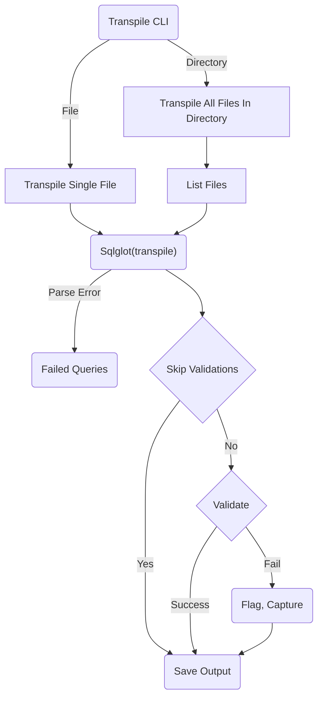
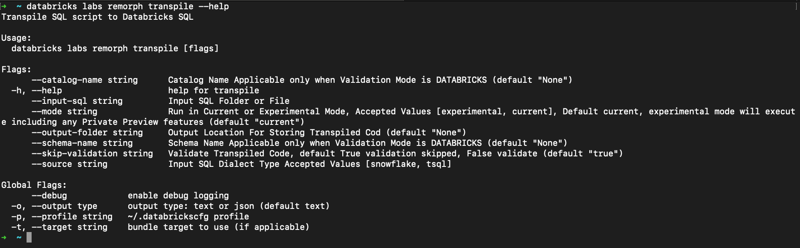

Databricks Labs Remorph
---


[]([https://codecov.io/github/databrickslabs/remorph](https://github.com/databrickslabs/remorph))

-----

# Table of Contents

* [Introduction](#introduction)
  * [Remorph](#remorph)
  * [Transpile](#transpile)
  * [Reconcile](#reconcile)
* [Environment Setup](#environment-setup)
* [How to use Transpile](#how-to-use-transpile)
    * [Installation](#installation)
    * [Verify Installation](#verify-installation)
    * [Execution Pre-Set Up](#execution-pre-set-up)
    * [Execution](#execution)
* [How to use Reconcile](#how-to-use-reconcile)
    * [Installation](#installation-1)
    * [Verify Installation](#verify-installation-1)
    * [Execution Pre-Set Up](#execution-pre-set-up-1)
    * [Execution](#execution-1)
* [Benchmarks](#benchmarks)
  * [Transpile](#Transpile-benchmarks)
  * [Reconcile](#Reconcile-benchmarks)
* [Frequently Asked Questions](#frequently-asked-questions)
  * [Transpile](#Transpile-faq)
  * [Reconcile](#Reconcile-faq)
* [Common Error Codes](#common-error-codes)
* [Project Support](#project-support)

----
# Introduction

## Remorph
Remorph stands as a comprehensive toolkit meticulously crafted to facilitate seamless migrations to Databricks. 
This suite of tools is dedicated to simplifying and optimizing the entire migration process, offering two distinctive functionalities – Transpile and Reconcile. Whether you are navigating code translation or resolving potential conflicts, Remorph ensures a smooth journey for any migration project. With Remorph as your trusted ally, 
the migration experience becomes not only efficient but also well-managed, setting the stage for a successful transition to the Databricks platform.

## Transpile
Transpile is a self-contained SQL parser, transpiler, and validator designed to interpret a diverse range of SQL inputs and generate syntactically and semantically correct SQL in the Databricks SQL dialect. This tool serves as an automated solution, named Transpile, specifically crafted for migrating and translating SQL scripts from various sources to the Databricks SQL format. Currently, it exclusively supports Snowflake as a source platform, leveraging the open-source SQLglot.

Transpile stands out as a comprehensive and versatile SQL transpiler, boasting a robust test suite to ensure reliability. Developed entirely in Python, it not only demonstrates high performance but also highlights syntax errors and provides warnings or raises alerts for dialect incompatibilities based on configurations.

### Transpiler Design Flow:


## Reconcile
Reconcile is an automated tool designed to streamline the reconciliation process between source data and target data residing on Databricks. Currently, the platform exclusively offers support for Snowflake, Oracle and other  Databricks tables as the primary data source. This tool empowers users to efficiently identify discrepancies and variations in data when comparing the source with the Databricks target.

----

# Environment Setup

1. `Databricks CLI` - Ensure that you have the Databricks Command-Line Interface (CLI) installed on your machine. Refer to the installation instructions provided for Linux, MacOS, and Windows, available [here](https://docs.databricks.com/en/dev-tools/cli/install.html#install-or-update-the-databricks-cli).

2. `Databricks Connect` - Set up the Databricks workspace configuration file by following the instructions provided [here](https://docs.databricks.com/en/dev-tools/auth/index.html#databricks-configuration-profiles). Note that Databricks labs use 'DEFAULT' as the default profile for establishing connections to Databricks.
   
3. `Python` - Verify that your machine has Python version 3.10 or later installed to meet the required dependencies for seamless operation.
   - `Windows` - Install python from [here](https://www.python.org/downloads/). Your Windows computer will need a shell environment ([GitBash](https://www.git-scm.com/downloads) or [WSL](https://learn.microsoft.com/en-us/windows/wsl/about))
   - `MacOS/Unix` - Use [brew](https://formulae.brew.sh/formula/python@3.10) to install python in macOS/Unix machines
#### Installing Databricks CLI on macOS


#### Install Databricks CLI via curl on Windows


#### Check Python version on Windows, macOS, and Unix


[[back to top](#table-of-contents)]

----


# How to Use Transpile

### Installation

Upon completing the environment setup, install Remorph by executing the following command:
```bash
databricks labs install remorph
```


[[back to top](#table-of-contents)]

----

### Verify Installation
Verify the successful installation by executing the provided command; confirmation of a successful installation is indicated when the displayed output aligns with the example screenshot provided:
```bash
 databricks labs remorph transpile --help
 ```


### Execution Pre-Set Up
1. Transpile necessitates input in the form of either a directory containing SQL files or a single SQL file. 
2. The SQL file should encompass scripts intended for migration to Databricks SQL.

Below is the detailed explanation on the arguments required for Transpile.
- `input-sql [Required]` - The path to the SQL file or directory containing SQL files to be transpiled.
- `source [Required]` - The source platform of the SQL scripts. Currently, only Snowflake is supported.
- `output-folder [Optional]` - The path to the output folder where the transpiled SQL files will be stored. If not specified, the transpiled SQL files will be stored in the same directory as the input SQL file.
- `skip-validation [Optional]` - The default value is True. If set to False, the transpiler will validate the transpiled SQL scripts against the Databricks catalog and schema provided by user.
- `catalog-name [Optional]` - The name of the catalog in Databricks. If not specified, the default catalog `transpiler_test` will be used.
- `schema-name [Optional]` - The name of the schema in Databricks. If not specified, the default schema `convertor_test` will be used.

### Execution
Execute the below command to intialize the transpile process.
```bash
 databricks labs remorph transpile --input-sql <absolute-path> --source <snowflake> --output-folder <absolute-path> --skip-validation <True|False> --catalog-name <catalog name> --schema-name <schema name>
```


[[back to top](#table-of-contents)]

----
# How to Use Reconcile

### Installation

Install Reconciliation with databricks labs cli.

```commandline
databricks labs install remorph
```


### Verify Installation
Verify the successful installation by executing the provided command; confirmation of a successful installation is indicated when the displayed output aligns with the example screenshot provided:
```bash
 databricks labs remorph reconcile --help
 ```


### Execution Pre-Set Up
>1. Setup the configuration file:

Once the installation is done, a folder named **.remorph** will be created in the user workspace's home folder.
To process the reconciliation for specific table sources, we must create a config file that gives the detailed required configurations for the table-specific ones.
The file name should be in the format as below and created inside the **.remorph** folder.
```
recon_config_<SOURCE>_<CATALOG_OR_SCHEMA>_<REPORT_TYPE>.json

Note: For CATALOG_OR_SCHEMA , if CATALOG exists then CATALOG else SCHEMA
```

eg:

| source_type | catalog_or_schema | report_type | file_name                             |
|-------------|-------------------|-------------|---------------------------------------|
| databricks  | tpch | all | recon_config_databricks_tpch_all.json |
| source1     | tpch | row | recon_config_source1_tpch_row.json    |
| source2     | tpch | schema | recon_config_source2_tpch_schema.json |

#### Refer to [Reconcile Configuration Guide][def] for detailed instructions and [example configurations][config]

[def]: docs/recon_configurations/README.md
[config]: docs/recon_configurations/reconcile_config_samples.md

> 2. Setup the connection properties

Remorph-Reconcile manages connection properties by utilizing secrets stored in the Databricks workspace.
Below is the default secret naming convention for managing connection properties.

**Note: When both the source and target are Databricks, a secret scope is not required.**

**Default Secret Scope:** remorph_{data_source}

| source | scope |
|--------|-------|
| snowflake | remorph_snowflake |
| oracle | remorph_oracle |
| databricks | remorph_databricks |

Below are the connection properties required for each source:
```
Snowflake:

sfUrl = https://<acount_name>.snowflakecomputing.com
account = <acount_name>
sfUser = <user>
sfPassword = <password>
sfDatabase = <database>
sfSchema = <schema>
sfWarehouse = <warehouse_name>
sfRole = <role_name>
pem_private_key = <pkcs8_pem_private_key>

Note: For Snowflake authentication, either sfPassword or pem_private_key is required. 
Priority is given to pem_private_key, and if it is not found, sfPassword will be used. 
If neither is available, an exception will be raised.
 
```

```
Oracle:

user = <user>
password = <password>
host = <host>
port = <port>
database = <database/SID>
```


### Execution
Execute the below command to initialize the reconcile process.
```bash
 databricks labs remorph reconcile
```


[[back to top](#table-of-contents)]

----

# Benchmarks

## Transpile-benchmarks
TBD

## Reconcile-benchmarks

### tpch `1000GB` data details

<table>

<tr>
<th>Table name</th>
<th>No of rows</th>
<th>Data Size</th>
<th>Set </th>
</tr>

<tr>
<td>supplier</td>
<td>10M</td>
<td>754.7 MiB</td>
<td>Set 1</td>
</tr>

<tr>
<td>customer</td>
<td>150M</td>
<td>11.5 GiB</td>
<td>Set 1</td>
</tr>

<tr>
<td>part</td>
<td>200M</td>
<td>5.8 GiB</td>
<td>Set 1</td>
</tr>

<tr>
<td>partsupp</td>
<td>800M</td>
<td>39.9 GiB</td>
<td>Set 1</td>
</tr>

<tr>
<td>orders</td>
<td>1.5B</td>
<td>62.4 GiB</td>
<td>Set 1</td>
</tr>

<tr>
<td>lineitem</td>
<td>6B</td>
<td>217.6 GiB</td>
<td>Set 2</td>
</tr>


</table>

### Databricks to Databricks Recon

The following benchmarks were conducted on various Databricks clusters. Please note that the reconciliation times listed below do not include cluster startup time.

>Cluster1 -- 14.3 LTS (includes Apache Spark 3.5.0, Scala 2.12) `Photon Enabled`
<table>
  <tr>
    <td></td>
    <td>VM</td>
    <td>Quantity</td>
    <td>Total Cores</td>
    <td>Total RAM</td>
  </tr>
  <tr>
    <td>Driver:</td>
    <td>**i3.xlarge**</td>
    <td>**1**</td>
    <td>**4 cores**</td>
    <td>**30.5 GB**</td>
  </tr>
  <tr>
    <td>Workers:</td>
    <td>**i3.xlarge**</td>
    <td>**10**</td>
    <td>**40 cores**</td>
    <td>**305 GB**</td>
  </tr>
</table>

>Cluster2 -- 14.3 LTS (includes Apache Spark 3.5.0, Scala 2.12) `Photon Enabled`
<table>
  <tr>
    <td></td>
    <td>VM</td>
    <td>Quantity</td>
    <td>Total Cores</td>
    <td>Total RAM</td>
  </tr>
  <tr>
    <td>Driver:</td>
    <td>**i3.2xlarge**</td>
    <td>**1**</td>
    <td>**8 cores**</td>
    <td>**61 GB**</td>
  </tr>
  <tr>
    <td>Workers:</td>
    <td>**i3.2xlarge**</td>
    <td>**10**</td>
    <td>**80 cores**</td>
    <td>**610 GB**</td>
  </tr>
</table>

>Benchmark

| Type           | Data                   | Cluster1 | Cluster2 |
|----------------|------------------------| --- | --- |
| With Threshold | tpch (set 1 and set 2)  | 1.46 hours | 50.12 minutes |
| Without Threshold | tpch (set 1 and set 2)  | 1.34 hours | 45.58 minutes |


### Snowflake to Databricks Recon

The following benchmarks were conducted on various Databricks clusters. Please note that the reconciliation times listed below do not include cluster startup time.

>Snowflake cluster details

<b>Type</b>: Standard

<b>Size</b>: Large Cluster (8 nodes, 64 cores)

>Cluster1 -- 13.3 LTS (includes Apache Spark 3.4.1, Scala 2.12)
<table>
  <tr>
    <td></td>
    <td>VM</td>
    <td>Quantity</td>
    <td>Total Cores</td>
    <td>Total RAM</td>
  </tr>
  <tr>
    <td>Driver:</td>
    <td>**i3.xlarge**</td>
    <td>**1**</td>
    <td>**4 cores**</td>
    <td>**30.5 GB**</td>
  </tr>
  <tr>
    <td>Workers:</td>
    <td>**i3.xlarge**</td>
    <td>**16**</td>
    <td>**64 cores**</td>
    <td>**488 GB**</td>
  </tr>
</table>

>Benchmark

| Method          | Configuration | Set         | Time |
|-----------------| ------------- |-------------| ---- |
| Spark (deafult) | -             | tpch - Set 1 | 32.01 minutes |
| Spark (deafult) | -             | tpch - Set 2 | 1.01 hours |
| JDBC            | number_partitions - 10 | tpch - Set 1 | 43.39 minutes |
| JDBC            | number_partitions - 10 | tpch - Set 2 | 1.17 hours |
| JDBC            | number_partitions - 64 | tpch - Set 1 | 25.95 minutes |
| JDBC            | number_partitions - 64 | tpch - Set 2 | 40.30 minutes |
| JDBC            | number_partitions - 100 | tpch - Set 2| 1.02 hours |


[[back to top](#table-of-contents)]

----

# Frequently Asked Questions

## Transpile-faq
TBD

## Reconcile-faq

<details>
<summary>Can we reconcile for Databricks without UC as a target?</summary>

***The reconciliation target is always Databricks with UC enabled. Reconciler supports non-uc Databricks only as a
source.***
</details>

<details>
<summary>What would happen if my dataset had duplicate records?</summary>

***Duplicates are not handled in the reconciler. If run with duplicates, it would result in inconsistent output. We can
implement
some workarounds to handle the duplicates, and the solution varies from dataset to dataset.***
</details>

<details>
<summary>Are User Transformations applicable for Schema Validations?</summary>

***No. User Transformations are not applied for Schema Validation.Only select_columns,drop_columns and column_mapping is
valid for schema validation.***
</details>

<details>
<summary>Can we apply Aggregate or multi-column transformations as user transformations?</summary>

***No. Aggregate transformations or multi-column transformations are not supported.***
</details>

<details>
<summary>Does Reconciler support all complex data types?</summary>

***Not all complex data types are supported currently.Reconciler do support UDFs for complex datatypes.Please refer here
for examples.***
</details>


<details>
<summary>Does Reconciler support `Column Threshold Validation` for report type as `row`?</summary>

***No. Column Threshold Validation is supported only for reports with the report type `data` or `all`, generally tables with
primary keys.***
</details>

[[back to top](#table-of-contents)]

----

## Common Error Codes:

TBD

----

# Project Support
Please note that all projects in the /databrickslabs github account are provided for your exploration only, and are not formally supported by Databricks with Service Level Agreements (SLAs).  They are provided AS-IS and we do not make any guarantees of any kind.  Please do not submit a support ticket relating to any issues arising from the use of these projects.

Any issues discovered through the use of this project should be filed as GitHub Issues on the Repo.  They will be reviewed as time permits, but there are no formal SLAs for support.
