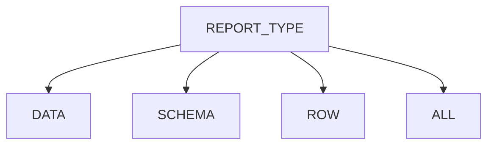
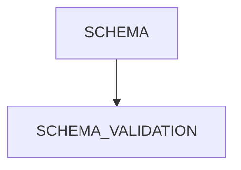
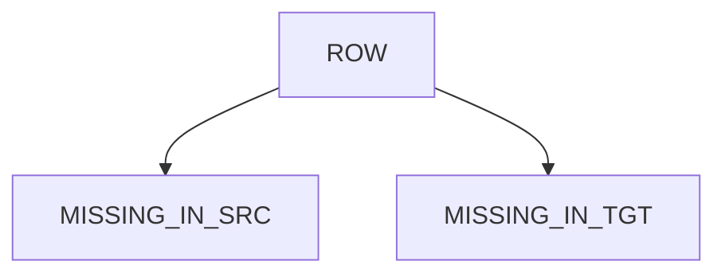
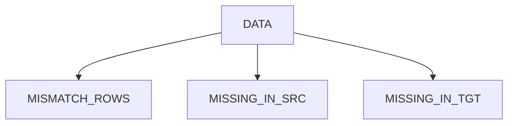
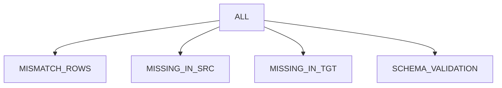

# Remorph Reconciliation

Remorph Reconciliation is a library that helps to reconcile the data, post data migration or during the data migration   
between the source system and databricks system.It supports multiple types of reconciliation depending upon the user   
requirements and data in the source system.It makes the migration process simpler by removing the complex part of
validating the data from one system to another and enabling the team with more insights on the data migrated.

## Installation

## Flow Chart for supported Report Type and Reconciliation Logics











## Supported Source System and Report Types

| Source     | Schema | Row | Data | All |
|------------|--------|-----|------|-----|
| Oracle     | Yes    | Yes | Yes  | Yes |
| Snowflake  | Yes    | Yes | Yes  | Yes |
| Databricks | Yes    | Yes | Yes  | Yes |

## Dependency CLI commands

TBD

## Environment Setup

TBD

## TABLE Config Elements:

| config_name         | data_type    | description                                                                                                                                                                                                                      | required/optional | example_value                                                                                                                  |
|---------------------|--------------|----------------------------------------------------------------------------------------------------------------------------------------------------------------------------------------------------------------------------------|-------------------|--------------------------------------------------------------------------------------------------------------------------------|
| source_name         | string       | name of the source table                                                                                                                                                                                                         | required          | product                                                                                                                        |
| target_name         | string       | name of the target table                                                                                                                                                                                                         | required          | product                                                                                                                        |
| join_columns        | list[string] | list of column names or column name which acts as primary key to the table                                                                                                                                                       | optional          | ["product_id"] or ["product_id","order_id"]                                                                                    |
| jdbc_reader_options | string       | jdbc_reader_option,that helps to parallelize the data read from jdbc sources based on the given configuration.For more info [jdbc_reader_options](#jdbc_reader_options)                                                          | optional          | "jdbc_reader_options": {"number_partitions": 10,"partition_column": "s_suppkey","upper_bound": "10000000","lower_bound": "10"} |
| select_columns      | list[string] | list of columns to be considered for the reconciliation process                                                                                                                                                                  | optional          | ["id","name","address"]                                                                                                        |
| drop_columns        | list[string] | list of columns to be eliminated from the reconciliation process                                                                                                                                                                 | optional          | ["comment"]                                                                                                                    |
| column_mapping      | list         | list of column_mapping,that helps in resolving column name mismatch b/w src and tgt eg: "id" in src  and "emp_id" in tgt.For more info [column_mapping](#column_mapping)                                                         | optional          | "column_mapping": [{"source_name": "id","target_name": "emp_id"}]                                                              |
| transformations     | list         | list of user-defined transformations ,that can be applied on src and tgt columns in case of any incompatibility data types or explicit transformation applied during migration.For more info [transformations](#transformations) | optional          | "transformations": [{"column_name": "s_address","source": "trim(s_address)","target": "trim(s_address)"}]                      |
| thresholds          | list         | list of threshold conditions, that can be applied on tgt columns to match the minor exceptions in data.It supports percentile,absolute, and date fields.For more info [thresholds](#thresholds)                                  | optional          | "thresholds": [{"column_name": "sal","lower_bound": "-5%","upper_bound": "5%","type": "integer"}]                              |
| filters             | string       | filter expr that can be used to filter the data on src and tgt based on respective expressions                                                                                                                                   | optional          | "filters" : {"source":"lower(dept_name)>'it'" ,"target" : "lower(department_name)>'it'"}                                       |

### jdbc_reader_options

| field_name        | data_type | description                                                                                                                                                                                                                                                                                                                                                                                                                                                            | required/optional | example_value |
|-------------------|-----------|------------------------------------------------------------------------------------------------------------------------------------------------------------------------------------------------------------------------------------------------------------------------------------------------------------------------------------------------------------------------------------------------------------------------------------------------------------------------|-------------------|---------------|
| number_partitions | string    | the number of partitions for reading input data in parallel                                                                                                                                                                                                                                                                                                                                                                                                            | required          | "200"         |
| partition_column  | string    | Int/date/timestamp parameter defining the column used for partitioning, typically the primary key of the source table. Note that this parameter accepts only one column, especially crucial when dealing with a composite primary key. In such cases, provide the column with higher cardinality.                                                                                                                                                                      | required          | "employee_id  |
| upper_bound       | string    | integer or date or timestamp without time zone value as string), that should be set appropriately (usually the maximum value in case of non-skew data) so the data read from the source should be approximately equally distributed                                                                                                                                                                                                                                    | required          | "1"           |
| lower_bound       | string    | integer or date or timestamp without time zone value as string), that should be set appropriately (usually the minimum value in case of non-skew data) so the data read from the source should be approximately equally distributed                                                                                                                                                                                                                                    | required          | "100000"      |
| fetch_size        | string    | This parameter influences the number of rows fetched per round-trip between Spark and the JDBC database, optimizing data retrieval performance. Adjusting this option significantly impacts the efficiency of data extraction, controlling the volume of data retrieved in each fetch operation. More details on configuring fetchSize can be found [here](https://docs.databricks.com/en/connect/external-systems/jdbc.html#control-number-of-rows-fetched-per-query) | optional          | "10000"       |

### column_mapping

| field_name  | data_type | description        | required/optional | example_value   |
|-------------|-----------|--------------------|-------------------|-----------------|
| source_name | string    | source column name | required          | "dept_id"       |
| target_name | string    | target column name | required          | "department_id" |

### transformations

| field_name  | data_type | description                                                | required/optional | example_value                    |
|-------------|-----------|------------------------------------------------------------|-------------------|----------------------------------|
| column_name | string    | the column name on which the transformation to be applied  | required          | "s_address"                      |
| source      | string    | the transformation sql expr to be applied on source column | required          | "trim(s_address)" or "s_address" |
| target      | string    | the transformation sql expr to be applied on source column | required          | "trim(s_address)" or "s_address" |

### thresholds

| field_name  | data_type | description                                                                                                                                                                  | required/optional                  | example_value      |
|-------------|-----------|------------------------------------------------------------------------------------------------------------------------------------------------------------------------------|------------------------------------|--------------------|
| column_name | string    | the column that should be considered for threshold reconciliation                                                                                                            | required                           | "product_discount" |
| lower_bound | string    | the lower bound of the difference between the source value and the target value                                                                                              | optional(default 0)                | -5%                | 
| upper_bound | string    | the upper bound of the difference between the source value and the target value                                                                                              | optional(default 0)                | 5%                 |            
| type        | string    | user must specify the type of the column. integer is selected for columns of type integer or double, while timestamp is chosen for columns of either date or timestamp types | required("integer" or "timestamp") | "integer"          |

### Key Considerations on Table Config:
1. The column names are always converted to lower case and considered for reconciliation.
2. Currently it doesn't support case sensitive column names
3. Table Transformation internally consider the default value as the column value. It doesn't apply any default transformations
if not provided.
```eg:Transformation(column_name="address",source_name=None,target_name="trim(s_address)")```
For the given example,
the source transformation is None,so the raw value in the source is considered for reconciliation.


### Do's and Don't's on Table Config:

1. Always the column reference to be source column names in all the configs,except **Transformations** and **Filters** as these
   are expressions ,that are applied directly in the sql.

# Guidance for Oracle as source

## Driver

1. **Download `ojdbc8.jar` from Oracle:**
   Visit the [official Oracle website](https://www.oracle.com/database/technologies/appdev/jdbc-downloads.html) to
   acquire the `ojdbc8.jar` JAR file. This file is crucial for establishing connectivity between Databricks and Oracle
   databases.

2. **Install the JAR file on Databricks:**
   Upon completing the download, proceed to install the JAR file onto your Databricks cluster. Refer
   to [this page](https://docs.databricks.com/en/libraries/workspace-libraries.html#upload-a-jar-python-egg-or-python-wheel)
   for comprehensive instructions on how to upload a JAR file, Python egg, or Python wheel to your Databricks workspace.

3. This installation is a necessary step to enable seamless comparison between Oracle and Databricks, ensuring that the
   required Oracle JDBC functionality is readily available within the Databricks environment.

## Commonly Used Custom Transformations

| source_type | data_type     | source_transformation                                                | target_transformation                           | source_value_example | target_value_example | comments                                                                                    |
|-------------|---------------|----------------------------------------------------------------------|-------------------------------------------------|----------------------|----------------------|---------------------------------------------------------------------------------------------|
| oracle      | number(10,5)  | trim(to_char(coalesce(<col_name>,0.0), '99990.99999'))               | cast(coalesce(<col_name>,0.0) as decimal(10,5)) | 1.00                 | 1.00000              | this can be used for any precision and scale by adjusting accordingly in the transformation |
| snowflake   | array         | array_to_string(array_compact(<col_name>),',')                       | concat_ws(',', <col_name>)                      |                      |                      | in case of removing "undefined" during migration(converts sparse array to dense array)      |
| snowflake   | array         | array_to_string(array_sort(array_compact(<col_name>),true,true),',') | concat_ws(',', <col_name>)                      |                      |                      | in case of removing "undefined" during migration and want to sort the array                 |
| snowflake   | timestamp_ntz | date_part(epoch_second,<col_name>)                                   | unix_timestamp(<col_name>)                      |                      |                      | convert timestamp_ntz to epoch for getting a match b/w snowflake and databricks             | 

## Data Reconciliation Examples:

For more Reconciliation Config examples ,please refer to [sample_notebook][link].

[link]: ./docs/reconciliation-configs-examples.py

## Note:
**In Reconciliation** 
1. Databricks with UC is the only target
2. Duplicates are not covered
3. User Transformations are not applied for Schema Validation.Only select_columns,drop_columns and column_mapping is valid for schema  
validation
4. Aggregate transformations or multi-column transformations are not supported
5. Not all complex data types are supported
