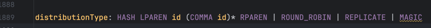
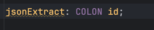
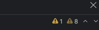
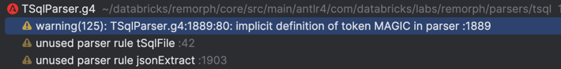

# Implementing Snowflake and Other SQL Dialects AST -> Intermediate Representation

Here's a guideline for incrementally improving the Snowflake -> IR translation in `SnowflakeAstBuilder`, et al.,
and the equivalent builders for additional dialects.

## Table of Contents
1. [Changing the ANTLR grammars](#changing-the-antlr-grammars)
2. [Conversion of AST to IR](#converting-to-ir-in-the-dialectthingbuilder-classes)
   1. [Step 1: add a test](#step-1-add-a-test)
   2. [Step 2: figure out the expected IR](#step-2-figure-out-the-expected-ir)
   3. [Step 3: run the test](#step-3-run-the-test)
   4. [Step 4: modify <Dialect><thing>Builder](#step-4-modify-dialectthingbuilder)
   5. [Step 5: test, commit, improve](#step-5-test-commit-improve)
   6. [Caveat](#caveat)

## Changing the ANTLR grammars

Changing the ANTLR grammars is a specialized task, and only a few team members have permission to do so.
Do not attempt to change the grammars unless you have been given explicit permission to do so.

It is unfortunately, easy to add parser rules without realizing the full implications of the change,
and this can lead to performance problems, incorrect IR and incorrect code gen.
Performance problems usually come from the fact that ANTLR will manage to make a working parser
out of almost any input specification. However, the resulting parser may then be very slow,
or may not be able to handle certain edge cases.

After a grammar change is made, the .g4 files must be reformatted to stay in line with the guidelines.
We use (for now at least) the [antlr-format](https://github.com/mike-lischke/antlr-format) tool to do this. The tool is run as part of the
maven build process, if you are using the 'format' maven profile. You can also run it from the command line
via make:

```bash
make fmt
```

or:

```bash
make fmt-scala
```

Also, there is a Databricks specific ANTLR linter, which you MUST run before checking in.

It can be run from the command line with:


```bash
make anltr-lint
```

And it will identify problems that the ANTLR tool does not consider problematic because it does
not have enough context. For instance, the ANTLR tool does not identify rules with no caller
as it must assume that they will be called from outside the grammar.

## Checking ANTLR changes

If you make changes to the ANTLR grammar, you should check the following things
(this is a good order to check them in):

 - Have you defined any new TOKENS used in the PARSER?
   - If so, did you define them in the LEXER?
 - Have you eliminated the use of any tokens (this is generally a good thing - such as replacing
   a long list of option keywords with an id rule, which is then checked later in the process)?
   - If so, have you removed them from the lexer?
 - Have you added any new rules? If so:
   - have you checked that you have not duplicated some syntactic structure that is already defined
     and could be reused?
   - have you checked that they are used in the parser (the IntelliJ plugin will highlight unused rules)?
 - Have you orphaned any rules? If so:
   - did you mean to do so?
   - have you removed them (the IntelliJ plugin will highlight unused rules)?
   - are you sure that removing them is the right thing to do? If you can create
     a shared rule that cuts down on the number of rules, that is generally a good thing.

You must create tests at each stage for any syntax changes. IR generation tests, coverage tests, and
transpilation tests are all required. Make sure there are tests covering all variants of the syntax you have
added or changed. It is generally be a good idea to write the tests before changing the grammar.

### Examples

#### Adding new tokens
Let's say you need to add a new type to this parser rule:

```antlr
distributionType: HASH LPAREN id (COMMA id)* RPAREN | ROUND_ROBIN | REPLICATE
    ;
```

So you change the rule to:

```antlrv4
distributionType: HASH LPAREN id (COMMA id)* RPAREN | ROUND_ROBIN | REPLICATE | MAGIC
    ;
```

The IDE plugin should be showing you that MAGIC is not defined as a token in the lexer by
underlining it.



You should then add a new token to the lexer:

```antlrv4
lexer grammar TSqlGrammar;
// ...
LOW                                         : 'LOW';
MAGIC                                       : 'MAGIC';
MANUAL                                      : 'MANUAL';
MARK                                        : 'MARK';
MASK                                        : 'MASK';
// ...
```

And the IDE should now be happy. Please keep the token definitions in alphabetical order of
the token name.

#### Orphaned Rules
Let's say that you have had to refactor some rules because something that was previously a standalone
rule is now incorporated into the expression syntax. So you change:

```antlrv4
r1          : SELECT id jsonExtract? FROM t1;
jsonExtract : COLON id;
```
To:

```antlrv4
r1          : SELECT expression FROM t1;
jsonExtract : COLON id;

expression  :
 // ...
 | expression COLON id
 // ...
```
You should now check to see if `jsonExtract` is used anywhere else for a number of reasons:
    - it may be that it is no longer needed and can be removed
    - it may be that it is used in other places and needs to be refactored to `expression`
      everywhere.
    - it may be that it is used in other places and needs to be left as is because it is
      a different use case.

Note that in general, if you can use `expression` instead of a specific rule, you should do so,
and resolve the expression type in the IR generation phase. We are generally looking to
parse correct input in this tool, and in any case a good grammar accepts almost anything
that _might_ be correct, and then performs semantic checks in the next phase after parsing,
as this gives better error output.

Be careful though, as sometimes SQL syntax is ambiguous and you may need to restrict the
syntactic element to a specific type such as `id` in order to avoid ambiguity.

Note as well, that if you are using the ANTLR plugin for IntelliJ IDEA, it will highlight rules
that are orphaned (not used) in the parser like so:



The underline in this case is easy to miss, but if you check the top right of the editor window
you will see that there is a warning there:



And click the icons wil switch to the problems view, where you can see the warnings:



Note that as of writing, there are a number of orphaned rules in the grammar that have
been left by previous authors. They will be gradually cleaned up, but do not add to the list.

Finally, some rules will appear to be orphaned, but are actually are the entry points for
the external calls into the parser. There is currently no way to mark these as such in the
plugin. You can generally assume they are external entry points if the rule ends in
`EOF` to indicate that it parses to the end of the input.

For instance:

```antlrv4
tSqlFile: batch? EOF
    ;
```
#### labels
Use of labels where they are not needed is discouraged. They are overused in the current
grammars. Use them where it makes it much easier to check in the ParserContext received by
the visit method. This is because a label creates a new variable, getters and associated
stuff in the generated method context.

There is no need for this:

```antlrv4
r1: XXX name=id YYY name2=id (name3=id)?
    ;
```
Just so you can reference `ctx.name` and so on in the visitor. You can use `ctx.id(0)`,
and so on:

```antlrv4
r1: XXX id YYY id id?
    ;
```

You should use labels where it makes both the rule and the visitor easier to read. For instance,
a rule with two optional parse paths, with a common element. Let's assume in the following
artificial example, the YY clause means two different things depending on if it
comes before or after the ZZ clause:

```antlrv4
r1: XX (YY id )? ZZ id (YY id)?
    ;
```

In the visitor, you will not know if the `id` is the first or second `id` in the `YY` clause
unless the size of ctx.id() is 3. So, you can use labels to make it clear:

```antlrv4
r1: XX (YY pre=id )? ZZ xx=id (YY post=id)?
    ;
```

Which means that in the visitor, you can check for `ctx.pre`, `ctx.xx` and `ctx.post` and know
for certain which `id` you are looking at.

#### Refactoring rules

In some cases, you may see that rules repeat long sequences of tokens. This is generally a bad
thing, and you should strive to merge them in to a common rule. Two to four tokens is generally
OK, but much longer than that, and you should consider refactoring. As of writing for instance,
there are many TSQL grammar rules for `create` vs `altet` where the original author has
repeated all the tokens and options. They will eventually be refactored into common rules.

Do not separate longer sequences of tokens into separate rules unless there is in fact
commonality between two or more rules. At runtime, a new rule will generate as a new method and
incur the setup and teardown time involved in calling a new rule.

If you see an opportunity to refactor, and it is because you have added a new rule or syntax
then do so. Refactoring outside the scope of your PR requires a second PR, or raise an issue.

In the current TSQL grammar, we can see that:
 - there are two rules using a common sequence of tokens that we can refactor into a common rule
 - that it is probably not worth doing that for `createLoginAzure`
 - `labels=` have been used for no reason.

```antlrv4
alterLoginAzureSql
    : ALTER LOGIN loginName = id (
        (ENABLE | DISABLE)?
        | WITH (
            PASSWORD EQ password = STRING (OLD_PASSWORD EQ oldPassword = STRING)?
            | NAME EQ loginName = id
        )
    )
    ;

createLoginAzureSql: CREATE LOGIN loginName = id WITH PASSWORD EQ STRING ( SID EQ sid = HEX)?
    ;

alterLoginAzureSqlDwAndPdw
    : ALTER LOGIN loginName = id (
        (ENABLE | DISABLE)?
        | WITH (
            PASSWORD EQ password = STRING (
                OLD_PASSWORD EQ oldPassword = STRING (MUST_CHANGE | UNLOCK)*
            )?
            | NAME EQ loginName = id
        )
    )
    ;
```

So, a refactor would look like this (in stages - later you will see it all at once):

```antlrv4
alterLoginAzureSql
    : ALTER LOGIN id passwordClause
    ;

createLoginAzureSql: CREATE LOGIN loginName = id WITH PASSWORD EQ STRING ( SID EQ sid = HEX)?
    ;

alterLoginAzureSqlDwAndPdw
    : ALTER LOGIN id passwordClause
    ;

passWordClause:
        (ENABLE | DISABLE)?
        | WITH (
            PASSWORD EQ STRING (
                OLD_PASSWORD EQ STRING (MUST_CHANGE | UNLOCK)*
            )?
            | NAME EQ  id
        )
    ;
```

In passwdClause we know in the visitor that ctx.STRING(0) is the password, and
ctx.STRING(1) is the old password. We can also check if ctx.MUST_CHANGE() or ctx.UNLOCK()
are present and because they are optional, we can share the passwdClause between the
two rules even though `alterLoginAzureSql` does not support them. The visitor can check
for them and raise an error if it is present in the wrong context, or we can assume valid
input and ignore it. We can now use a specific buildPasswordClause method in the visitor to
return some common definition of a password clause.

But... we now realize that `createLoginAzureSql` and `alterLoginAzureSqlDwAndPdw` are the same
and there is only need for one of them. So we can merge them into one and remove and extra
entry in the calling clause, which in the TSQL grammar is `ddlClause`, and hey presto we
have removed a rule, reduced parser complexity, and made the grammar easier to read. If there
is any IR difference between the two, we can handle that in the visitor.

### Installing antlr-format

The antlr-format tool will run as part of the maven build process and so there is no need to install it locally.
But you can do so using the instructions below.

In order to run the tool, you have to install Node.js. You can download it from [here](https://nodejs.org/en/download/),
or more simply install it with `brew install node` if you are on a Mac.

Once node is installed you can install the formatter with:

```bash
npm install -g antlr-format
npm install -g antlr-format-cli
```

### Running antlr-format

The formatter is trivial to run from the directory containing your changed grammar:

```bash
~/databricks/remorph/core/src/main/antlr4/../parsers/tsql (feature/antlrformatdocs ✘)✹ ᐅ antlr-format *.g4

antlr-format, processing options...

formatting 2 file(s)...

done [82 ms]
```

Note that the formatting configuration is contained in the .g4 files themselves, so there is no need to
provide a configuration file. Please do not change the formatting rules.

### Caveat

Some of the grammar definitions (`src/main/antlr4/com/databricks/labs/remorph/parsers/<dialect>/<dialect>Parser.g4`)
may still be works-in-progress and, as such, may contain rules that are either incorrect or simply
_get in the way_ of implementing the <dialect> -> IR translation.

When stumbling upon such a case, one should:
- materialize the problem in a (failing) test in `<Dialect><something>BuilderSpec`, flagged as `ignored` until the problem is solved
- shallowly investigate the problem in the grammar and raise a GitHub issue with a problem statement
- add a `TODO` comment on top of the failing test with a link to said issue
- point out the issue to someone tasked with changing/fixing grammars
- move on with implementing something else

## Converting to IR in the <Dialect><thing>Builder classes

Here is the methodology used to effect changes to IR generation.

### Step 1: add a test

Let say we want to add support for a new type of query, for the sake of simplicity we'll take
`SELECT a FROM b` in SnowFlake, as an example (even though this type of query is already supported).

The first thing to do is to add an example in `SnowflakeAstBuilderSpec`:

```scala
"translate my query" in { // find a better test name
  example(
    query = "SELECT a FROM b",
    expectedAst = ir.Noop
  )
}
```

### Step 2: figure out the expected IR

Next we need to figure out the intermediate AST we want to produce for this specific type of query.
In this simple example, the expected output would be
`Project(NamedTable("b", Map.empty, is_streaming = false), Seq(Column("a")))`
so we update our test with:

```scala
// ...
    expectedAst = Project(NamedTable("b", Map.empty, is_streaming = false), Seq(Column("a")))
// ...
```

Less trivial cases may require careful exploration of the available data types in
`com.databricks.labs.remorph.parsers.intermediate` to find to proper output structure.

It may also happen that the desired structure is missing in `com.databricks.labs.remorph.parsers.intermediate`.
In such a case, **we should not add/modify anything to/in the existing AST**, as it will eventually be generated
from an external definition. Instead, we should add our new AST node as an extension in `src/main/scala/com/databricks/labs/remorph/parsers/intermediate/extensions.scala`.

### Step 3: run the test

Our new test is now ready to be run (we expect it to fail). But before running it, you may want to uncomment the
`println(tree.toStringTree(parser))` line in the `parseString` method of `SnowflakeAstBuilderSpec`.

It will print out the parser's output for your query in a LISP-like format:

```
(snowflake_file (batch (sql_command (dml_command (query_statement (select_statement (select_clause SELECT (select_list_no_top (select_list (select_list_elem (column_elem (column_name (id_ a))))))) (select_optional_clauses (from_clause FROM (table_sources (table_source (table_source_item_joined (object_ref (object_name (id_ b))))))))))))) <EOF>)
```

This will be useful to know which methods in `SnowflakeAstBuilder` you need to override/modify.
Note however, that ANTLR4 generated parser tree visitors automatically call accept on nodes,
so you do not always need to override some intermediate method, just to call accept() yourself.

### Step 4: modify <Dialect><thing>Builder

Method names in `<Dialect><something>Builder` follow the names that appear in the parser's output above. For example,
one would realize that the content of the `columnName` node is what will ultimately get translated as an IR `Column`.
To do so, they therefore need to override the `visitColumnName` method of `SnowflakeExpressionBuilder`.

Rather than have a single big visitor for every possible node in the parser's output, the nodes are handled by
specialized visitors. For instance `TSqlExpressionBuilder` and `SnowflakeExpressionBuilder`. An instance of the `<dialect>ExpressionBuilder`
is injected into the `<dialect>AstBuilder`, which in turn calls accept using the expressionBuilder on a node that
will be an expression within a larger production, such as visitSelect.

The <something> builders have one `visit*` method for every node in the parser's output that the builder is responsible
for handling. Methods that are not overridden simply return the result of visiting children nodes. So in our example,
even though we haven't overridden the `visitColumnElem` method, our `visitColumnName` method will get called as expected
because ANTLR creates a default implementation of `visitColumnElem` tha that calls `accept(this)` on the `columnName` node.

However, note that if a rule can produce multiple children using the default `visit`, you will need to override the
method that corresponds to that rule and produce the single IR node that represents that production.

A rule of thumb for picking the right method to override is therefore to look for the narrowest node (in the parser's output)
that contains all the information we need. Once you override a `visit` function, you are then responsible for either
calling `accept(<visitor>)` on its child nodes or otherwise processing them using a specialized `build<something>` method.

Here, the `(id_ a)` node is "too narrow" as `id_` appears in many different places where it could be translated as
something else than a `Column` so we go for the parent `columnName` instead.

Moving forward, we may realize that there are more ways to build a `Column` than we initially expected so we may
have to override the `visitColumnElem` as well, but we will still be able to reuse our `visitColumnName` method, and
have `visitColumnElem` call `accept(expressionBuilder)` on the `columnName` node.

### Step 5: test, commit, improve

At this point, we should have come up with an implementation of `<Dialect><something>Builder` that makes our new test pass.
It is a good time for committing our changes.

It isn't the end of the story though. We should add more tests with slight variations of our initial query
(like `SELECT a AS aa FROM b` for example) and see how our new implementation behaves. This may in turn make us
change our implementation, repeating the above steps a few times more.
