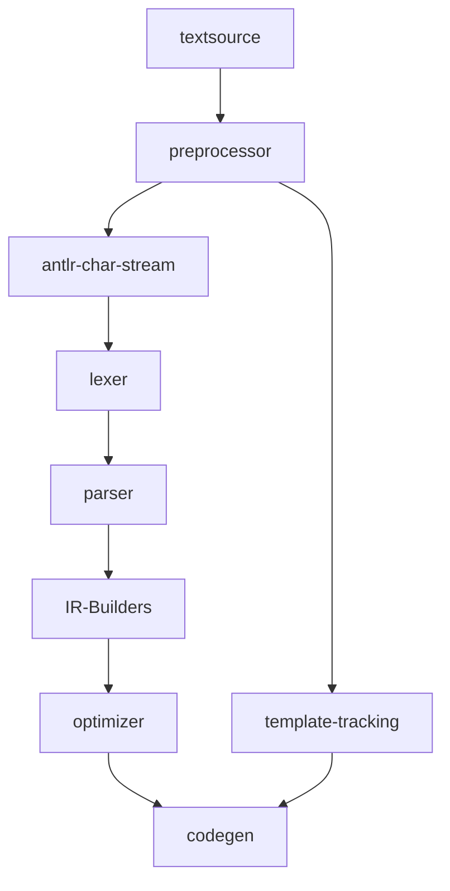

# A preprocessor for macros, parameters, Jinga templates, and DBT

Many organizations manage their SQL based apps using DBT, which is a system based upon
Jinga templating engine. Hence remorph must be able to find source dialect SQL embedded in
these templates and convert the embedded SQL to the target dialect, rebuilding the templates
accordingly.

## Sample Template

```sql
WITH order_payments AS (
    SELECT
        order_id,
        {# payment_methods is a list of strings - this is a comment #}
        
        SUM(CASE WHEN payment_method = '{{ payment_method }}'
            THEN amount else 0 end) AS {{ payment_method }}_amount,
        
        SUM(amount) AS total_amount
    FROM {{ ref('payments') }}
    GROUP BY order_id
)
SELECT * FROM order_payments
```

The example shows a query embdedded in a DBT/Jinga template and shows the various ways in which
macros and template references are used. We see that:

 - literal strings can contain template/parameter references: `'{{ payment_method }}'`
 - `` templates can contain templating code: ``
 - `{{ ref('payments') }}` is a macro call

Of note, we see that a template use such as `{{ payment_method }}_amount` will generate text that
creates a single Identifier, and so whitespace needs to be accounted for in the generated code, as
there is a clear difference in generated template output depending upon whether whitespace
is present or not:

```sql
 SELECT {{ x }}    xalias FROM table
 SELECT {{ x }}_not_alias FROM table
```

###  Complications

 - Jinga allows the user to change the delimiters for the templates from the default `{{ }}` to anything else. Hence
   it is going to be difficult to use an ANTLR lexer to tokenize the text, as the lexer will not know what the current 
   delimiter. However, the need for something as heavyweight as an ANTLR lexer is debatable anyway.
 - While in many cases the templates will be used in place of say expressions, and therefore we can just accept a
   special token such as say: `NINJAEXPR: '{{}}' ;`. However, we are going to find both statement and expression
   templates located in places where the current SQL parser will not expect them. In the example above, the statement
   template `` is located in the middle of a SQL statement. In this case
   we would need to allow templates to occur anywhere in the parse in violation of the normal syntax rules.
 - Jinga allows line statements, also with the prefix being configurable. Hence, we need to be able to handle
   them too. Typically, they would start with a single prefix such as `# for item in seq`, and the entire line
   is a ninja statement.
 - There is nothing stopping a user from stuffing variables with actual SQL statements. We will probably draw a
   line at supporting that.

## The preprocessor

As the templates are just text with the macro types above sprinkled in, we can create a preprocessor
that will always run against the given input text, even if, with un-templated SQL, the preprocessor
will merely pass through what it sees. However, there may well be other functionality for the preprocessor
to provide in the future such as perhaps parameter tracking/processing.

Hence the preprocessor will be a simple text processor that will:

 - find and replace all `{{ }}`, `{# #}` and `` blocks with a placeholder
 - track the unique placeholders and their original text
 - pass through the placeholders to the target SQL lexer, which will allow


## Workflow chart



TBC ...
