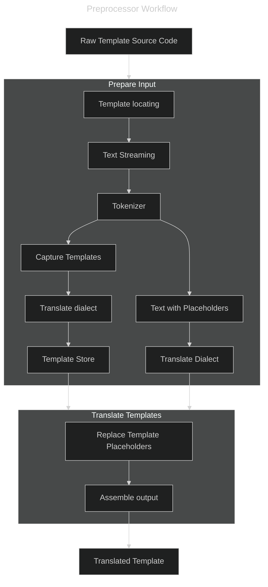
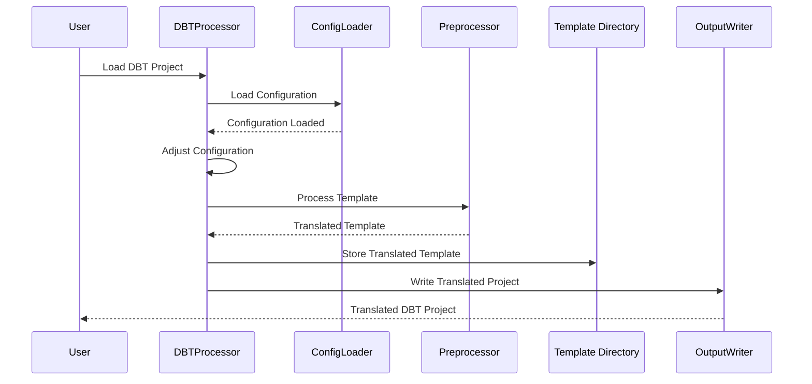

# A preprocessor for macros, parameters, Jinga templates, and DBT

Many organizations manage their SQL based apps using DBT, which is a system based upon
Jinga templating engine. Hence remorph must be able to find source dialect SQL embedded in
these templates and convert the embedded SQL to the target dialect, rebuilding the templates
accordingly.

## Sample Template

```sql
WITH order_payments AS (
    SELECT
        order_id,
        {# payment_methods is a list of strings - this is a comment #}
        
        SUM(CASE WHEN payment_method = '{{ payment_method }}'
            THEN amount else 0 end) AS {{ payment_method }}_amount,
        
        SUM(amount) AS total_amount
    FROM {{ ref('payments') }}
    GROUP BY order_id
)
SELECT * FROM order_payments
```

The example shows a query embdedded in a DBT/Jinga template and shows the various ways in which
macros and template references are used. We see that:

 - literal strings can contain template/parameter references: `'{{ payment_method }}'`
 - `` templates can contain templating code: ``
 - `{{ ref('payments') }}` is a macro call

Of note, we see that a template use such as `{{ payment_method }}_amount` will generate text that
creates a single Identifier, and so whitespace needs to be accounted for in the generated code, as
there is a clear difference in generated template output depending upon whether whitespace
is present or not:

```sql
 SELECT {{ x }}    xalias FROM table
 SELECT {{ x }}_not_alias FROM table
```

###  Complications

 - Jinga allows the user to change the delimiters for the templates from the default `{{ }}` to anything else. Hence
   lexical tricks are used such that we can still use an ANTLR based lexer as the basis of the preprocessor.
 - In many cases the templates will be used in place of say, _expressions_, and therefore we can just accept a
   special token such as say: `NINJAEXPR: '{{}}' ;`. 
   - However, we are going to find both statement and expression
     templates located in places where the current SQL parser will not expect them. In the example above, the statement
     template `` is located in the middle of a SQL statement. In this case
     we would need to allow templates to occur anywhere in the parse in violation of the normal syntax rules. That is essentionally, not viable.
 - Jinga allows line statements, also with the prefix being configurable. Hence, we need to be able to handle
   them too. Typically, they would start with a single prefix such as `# for item in seq`, and the entire line
   is a ninja statement.
 - There is nothing stopping a user from stuffing variables with actual SQL statements. We will probably draw a
   line at supporting that.
 - Macros can contain bits of SQL code, which we may be able to attempt to translate by trying different entry points
   into the SQL parser. However, this is not guaranteed to be successful as literalyl anything can be put anywhere 
   in macros
 - There are macros that do things like add or not add commas at the ends for loops of text generation. We can cater
   for this using the generally accepted practice of allow trailing commas in sequences, so we can accept partial
   lists of columns, for example.

## Approaches to handling templates

We should first note that our template handler/preprocessor is not expanding the templates, but locating them and
translating embedded SQL. The templates themselves will be left in place, and the translated SQL will be adorned
with them. We are writing a XXX SQL plus DBT to Databricks SQL plus DBT, such that users will then maintain the
Databricks SQL alongside their templates.

We therefore have the following approaches:

### Lexing and Placeholding

As there are few constructs in the templates, we can lex the raw input, store the gathered tokens, and replace
them with a single token identifying the template. The TSQL grammars then need only look for simple template
references and not have to worry about the template syntax itself. The pre-processor here becomes more of a controller
in that it can transform pieces of the input text by calling the source dialect transpiler and the code generator
for each component of the source text. However, the grammars for the source dialects will need to be modified
to accept the template tokens at strategic points in the parse.

#### Advantages

 - The lexer and parser are not burdened with the template syntax
 - The lexer and parser can be used with a few modifications

#### Disadvantages

 - Templates can be placed anywhere, so the grammar will need to be strategically adorned with valid
   places that templates can occur. This is not a trivial task, however it is doable if we accept that
   we will not be able to process some esoteric uses of templates, which are generally abuses of the concept.
   For instance `SELECT A {{ , }} B {{ , }} C` is not a reasonable construct. It would need to be dealt
   with manually.

### In-place parsing

While similar to the above, we could capture and manage the actual templates in the dialect grammars. This
removes the need for a pre-processor but means that we woudl need to include more pieces of ANTLR
specification in each dialect grammar. It also smells like not separating clear responsibilities/functionality.

#### Advantages

 - No need for a pre-processor as such

#### Disadvantages

 - We end up with code dealing with templates intermingled with the dialect parsing code
 - We still need to track the templates and their locations, so we are not saving any coding effort

### Translate on the fly

One other approach would be to defer the translation of the templates until the SQL is produced by
DBT, then convert on the fly. 

#### Advantages

 - No need to modify the dialect grammars
 - No need to track templates

#### Disadvantages

 - We do not guarantee that we can perform a 100% conversion of the incoming source dialect
 - Users would then be maintaining code in the source dialect, which is not the goal of the project

## The preprocessor

We therefore conclude that the best approach is to use a preprocessor that will locate and track the templates
and replace them in the pre-processed stream with a placeholder.

As the templates are just text with the macro types above sprinkled in, we can create a preprocessor
that will always run against the given input text, even if, with un-templated SQL, the preprocessor
will merely pass through what it sees. However, there may well be other functionality for the preprocessor
to provide in the future such as perhaps parameter tracking/processing, or perhaps daisy-chaining of
pre-processors that perform specific tasks.

Hence the preprocessor will be a simple text processor that will:

 - find and replace all `{{ }}`, `{# #}` and `` blocks with a placeholder
 - track the unique placeholders and their original text
 - pass through the placeholders to the target SQL lexer
 - modify the grammars such that the placeholders are accepted at strategic points in the parse
 - attempt to convert any SQL within expression macros (complicated by the fact that the Jinga 
   syntax contains things that look like function calls - we are likely to need a Jinga parser
 - attempt to convert the SQL within the text where the macros are replaced with placeholders.
 - the code generator will just pass the placeholders back to the template processor and 
   the template processor will replace the placeholders with the translated templates.

## Workflow


## DBT Projects

As well as the template processing, we will need to bring in the DBT configuration and associated fluff that
goes with a complete DBT project layout. This includes processing the .yml configuration files and using
anything from the configuration that is required to generate the Databricks DBT project. This will be a separate
utility which will coordinate with the preprocessor to ensure that the correct configuration is used and that
the translated templates are stored in the appropriate location for the DBT project.

A simplified sequence diagram of the process is shown below:


