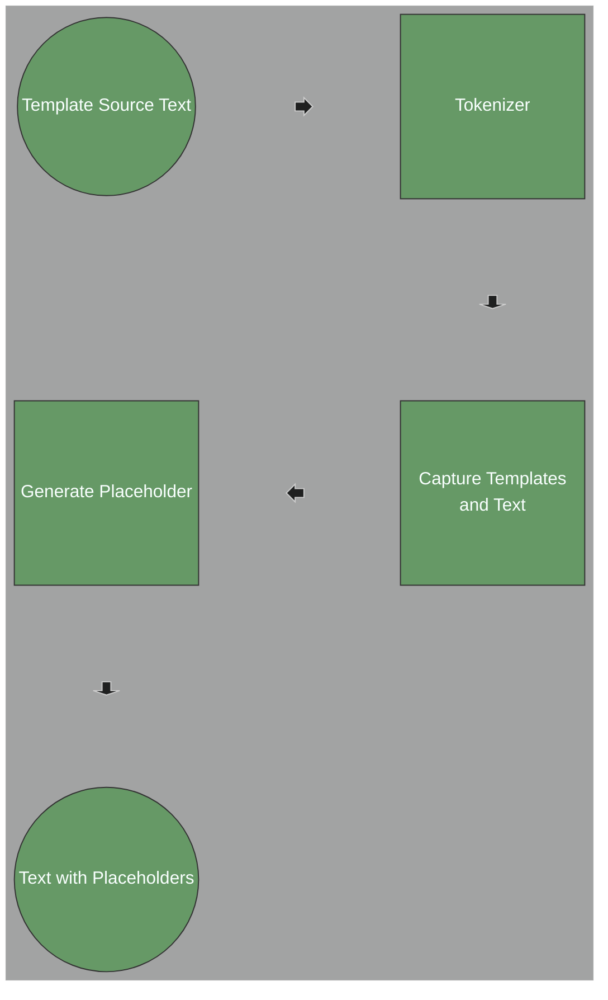
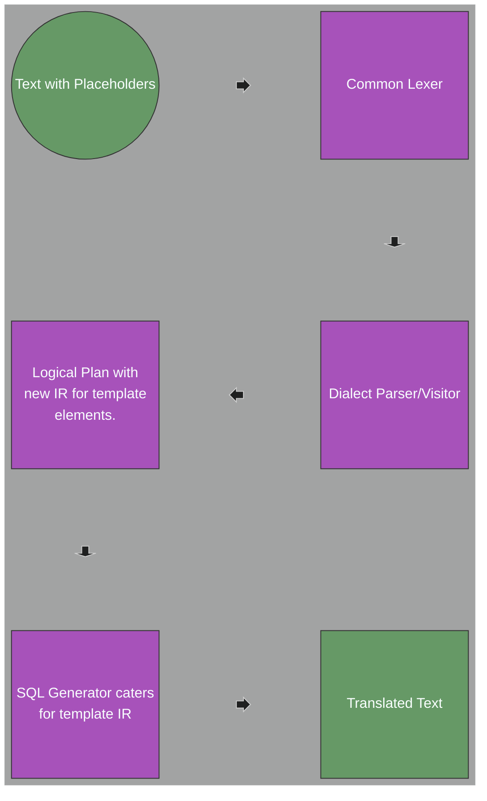
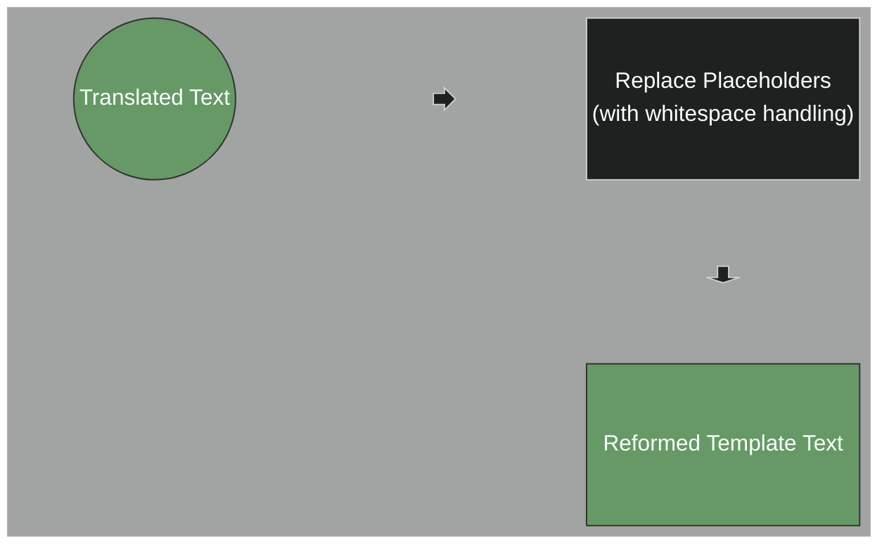
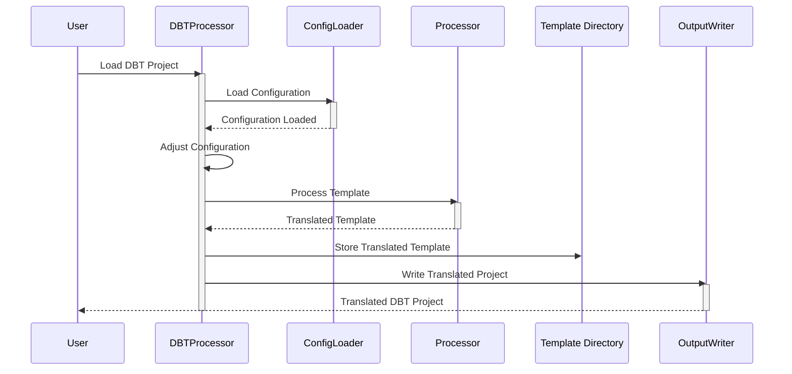

# A Processor for Jinja Templates, and DBT Projects

| |                  |
|:-----------------------|:-----------------|
| **Author**             | Jim Idle         |
| **Engineering Owner**  | Serge Smertin    |
| **Product Owner**      | Guenia Izquierdo |
| **Status**             | Draft for review |

Major Changes:

 - 2024-11 Initial draft
 - 2024-11 Modifed solution descriptions after prototyping/experimentation
 - 2024-11 Added workflow diagrams
 - 2024-11 Added DBT project section
 - 2024-11 Added placeholders section and explanations

# Table of Contents
- [A preprocessor for macros, parameters, Jinja templates, and DBT](#a-preprocessor-for-macros-parameters-jinja-templates-and-dbt)
   - [Motivation](#motivation)
   - [Definitions](#definitions)
   - [Sample Template](#sample-template)
   - [Complications](#complications)
   - [Approaches to handling templates](#approaches-to-handling-templates)
      - [Lexing and Placeholding](#lexing-and-placeholding)
      - [In-place parsing](#in-place-parsing)
      - [Translate on the fly](#translate-on-the-fly)
   - [The preprocessor](#the-preprocessor)
      - [Placeholders](#placeholders)
      - [Workflow](#workflow)
   - [DBT Projects](#dbt-projects)

## Motivation

Many customers converting from a particular SQL dialect to Databricks SQL will have adopted
Jinja templates, usually in the form of DBT projects. These templates will contain SQL code
in the source dialect, which we must transpile to Databricks SQL, while preserving the original
template structure. 

Here, we define the approach to handling these templates within the existing
remorph framework, and approach to handling DBT project conversion.

## Definitions

 - Template - a template is a piece of text that contains placeholders for variables, loops, and
   conditional statements in a format defined by the Jinja template engine. 
 - Template Element The templates contain templating elements enclosed in `{{ }}`, `{# #}`, 
   and `` blocks.
 - Statement Element - a statement element is a template element that contains Jinja processing
   directives such as a loop or conditional statement. They are enclosed in `` blocks and
   quite often consist of matched pais of `` blocks for things like `if` `end`.
 - Expression Element - an expression element is a template element that contains a variable
   reference or a function call. They are enclosed in `{{ }}` blocks.
 - Text Element - a text element is a piece of text that is not a template element - it is just
   free text. It is passed through the Jinja processor unchanged. In our case the text will be
   SQL code in a particular dialect and we must translate it to Databricks SQL.

## Proposal sketches

In the following diagrams, existing components are shown in blue, modified components in Magenta,
and new components are shown in green.

Firstly, we introduce a new pre-processing phase in the toolchain. This phase is based upon and ANTLR lexer and supporting
Scala code. Raw text is passed through, but template elements are located and replaced with placeholders (defined later 
in this document). The resulting text can then be used in the existing ANTLR based toolchain.

In the process of capturing the template elements, we will note whether the template element was preceded or followed by
whitespace. This is important when regenerating the template elements in the post-processing phase.



The placeholders are then used in the existing ANTLR based toolchain, with some modifications:



There is then another additional post-processing phase that will replace the placeholders with the template element
text. If the original template element was not preceded or followed by whitespace, then placeholders will elide preceding
of following whitespace accordingly. This allows the code generator to be as simple as possible. Not that this phase must
be applied before any SQL formatting is applied.



## Sample Template

```sql
WITH order_payments AS (
    SELECT
        order_id,
        {# payment_methods is a list of strings - this is a comment #}
        
        SUM(CASE WHEN payment_method = '{{ payment_method }}'
            THEN amount else 0 end) AS {{ payment_method }}_amount,
        
        SUM(amount) AS total_amount
    FROM {{ ref('payments') }}
    GROUP BY order_id
)
SELECT * FROM order_payments
```

The example shows a query embdedded in a DBT/Jinja template and shows the various ways in which
macros and template references are used. We see that:

 - literal strings can contain template/parameter references: `'{{ payment_method }}'`
 - `` templates can contain templating code: ``
 - `{{ ref('payments') }}` is a macro, which invokes a function. IN this case ref is a function that
   returns a string stored in a variable called payments.

Of note, we see that a template use such as `{{ payment_method }}_amount` will generate text that
creates a single Identifier, and so whitespace needs to be accounted for in the generated code, as
there is a clear difference in generated template output depending upon whether whitespace
is present or not:

```sql
 SELECT {{ x }}    xalias FROM table
 SELECT {{ x }}_not_alias FROM table
```

###  Complications

 - Jinja allows the user to change the delimiters for the templates from the default `{{ }}` to anything else. Hence
   lexical tricks are used such that we can still use an ANTLR based lexer as the basis of the preprocessor.
 - In many cases the templates will be used in place of say, _expressions_, and therefore we can just accept a
   special token: `NINJAEXPR: 'Jinja_' [0-9]+ ;`. 
   - However, we are going to find both statement and expression
     templates located in places where the current SQL parser will not expect them. In the example above, the statement
     template `` is located in the middle of a SQL statement. In this case
     we would need to allow templates to occur anywhere in the parse in violation of the normal syntax rules. 
 - Jinja allows line statements, also with the prefix being configurable. Hence, we need to be able to handle
   them too. Typically, they would start with a single prefix such as `# for item in seq`, and the entire line
   is a ninja statement.
 - There is nothing stopping a user from stuffing variables with actual SQL statements. We will probably draw a
   line at supporting that, although when translating say an entire DBT project, we will likely find the definition
   of the variables and they would then be translated naturally.
 - Macros can contain bits of SQL code, which we may be able to attempt to translate by trying different entry points
   into the SQL parser. However, this is not guaranteed to be successful as literally anything can be put anywhere 
   in macros.
 - There are macros that do things like add or not add commas at the ends for loops of text generation. We can cater
   for this using the generally accepted practice of allow trailing commas in sequences, so we can accept partial
   lists of columns, for example.

## Major alternatives to handling templates

We should first note that our template handler/preprocessor is not expanding the templates, but locating them and
translating embedded SQL. The templates themselves will be left in place, and the translated SQL will be adorned
with them exactly as it was before transpilation. 

In other words we are writing a XXX SQL plus DBT to Databricks SQL plus DBT, such that users will then maintain the
Databricks SQL alongside their templates.

We therefore have the following approaches:

### Lexing and Placeholding

This is the proposed approach.

As there are few constructs in the templates, we can lex the raw input, store the gathered template elements, and replace
them with a single token identifying the template element. 

The SQL grammars then need only look for simple template references and not have to worry about the template syntax itself.
However, the grammars for the source dialects will need to be modified to accept the template tokens at strategic points 
in the parse. We note that it may not be possible to cover 100% of the esoteric uses of templates, but we can cover the
majority. The existing system for handling parsing errors will generate code that shows why we could not parse what looked
like SQL but the template was used in a place where it is impossible to parse it. 

#### Advantages

 - The existing lexers and parsers are not burdened with the template syntax
 - The lexers, parsers and code generator can be used with a few small modifications

#### Disadvantages

 - Templates can be placed anywhere, so the grammar will need to be strategically adorned with valid
   places that templates can occur. This is not a trivial task, however it is doable if we accept that
   we will not be able to process some esoteric uses of templates, which are generally abuses of the concept.
   For instance `SELECT A {{ , }} B {{ , }} C` is not a reasonable construct. It would need to be dealt
   with manually.

### In-place parsing

While similar to the above, we could capture and manage the actual templates in the dialect grammars. This
removes the need for a pre-processor but means that we would pollute the existing pipeline wiht template handling. 
It smells like not separating clear responsibilities/functionality. Because teh delimiters for template elements
can be changed by the user, the common lexer would need to know about DBT configs and so on.

#### Advantages

 - No need for a pre-processor as such

#### Disadvantages

 - We end up with code dealing with templates intermingled with the dialect parsing code
 - We still need to track the templates, so we are not saving any coding effort, just moving it around

### Translate on the fly

One other approach would be to defer the translation of the templates until the SQL is produced by
DBT, then convert on the fly. 

#### Advantages

 - No need to modify the dialect grammars
 - No need to track templates

#### Disadvantages

 - We do not guarantee that we can perform a 100% conversion of the incoming source dialect
 - Users would then be maintaining code in the source dialect, which is not the goal of the project

# Part II - Implementation Details

## The Processor

We therefore conclude that the best approach is to use a preprocessor that will locate and track the templates
and replace them in the pre-processed output with a placeholder.

As the templates are just text with the macro types above sprinkled in, we can create a preprocessor
that will always run against the given input text, even if, with un-templated SQL, the preprocessor
will merely pass through what it sees. However, there may well be other functionality for the preprocessor
phase to provide in the future such as perhaps parameter tracking/processing, or perhaps daisy-chaining of
pre-processors that perform specific tasks. The optimizer phase of the toolchain shows the value of being
able to apply multiple transformations in any particular transpilation phase.

Hence the preprocessor will be a simple text processor that will:

 - find and replace all `{{ }}`, `{# #}` and `` blocks with a placeholder
 - track the unique placeholders and their original text
 - pass through the placeholders to the common SQL lexer

To process the preprocessor output, we will:

 - modify the dialect grammars such that the placeholders are accepted at strategic points in the parse
 - attempt to convert the SQL within the text where the macros are replaced with placeholders.
 - the code generator will just pass the placeholders back to the template processor and 
   the template processor will replace the placeholders with the template elements, which may
   also require some form of processing, which can now be handled outside of the toolchain.

Note that Jinja template elements cannot contain random text and so at this time, we ssee no need to
process them in any way. However, shoudl the need arise, we can now 

### Placeholders

The placeholders will be simple strings that are unique to the template. A template manager will
generate placeholder names in the form: `_!JinjaNNNN` where `NNNN` is a unique number, generated
sequentially. This allows the common lexer to be used for all dialects, as the placeholders will
always be of the same form. At this point we do not need to distinguish between the types of template
element (statement, expression, etc.) as they will be replaced via a post-processing step. The IR
generator will create a new IR node for each placeholder, holding its text value, and the code 
generator will merely replace the placeholders with the text value. After code generation completes,
the placeholders will be replaced with the template definitions using a post-processing step.

## DBT Projects

As well as the template processing, we will need a DBT processor to bring in the DBT configuration and associated fluff that
goes with a complete DBT project layout, and translate every SQL bearing template. 

This includes processing the .yml configuration files and using anything from the configuration that is required to 
generate the Databricks DBT project. This will be a separate utility which will coordinate with the transpiler to ensure 
that the correct configuration is used and that the translated templates are stored in the appropriate location for the DBT project.

A conversion will create a new DBT project (leaving the original input intact) with the same structure as the original, 
but with the SQL code translated to Databricks SQL. The ourput will 

A simplified sequence diagram of the process is shown below:


