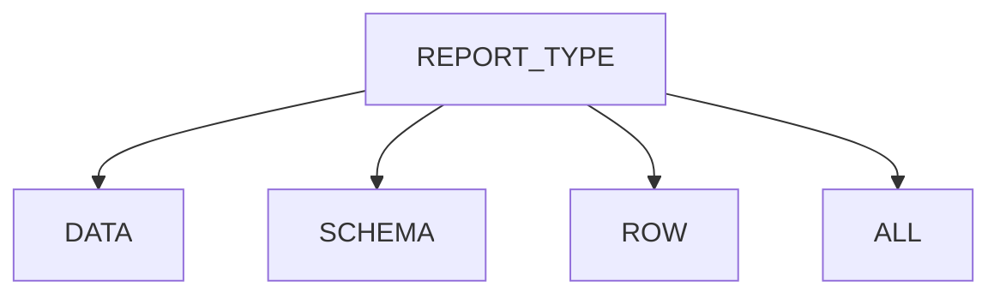
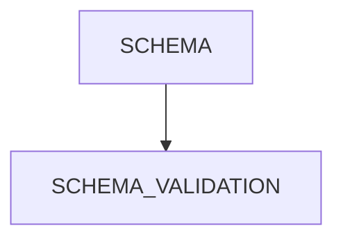
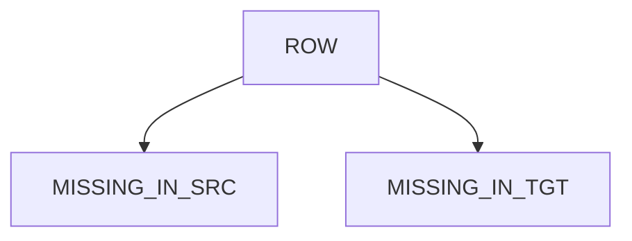
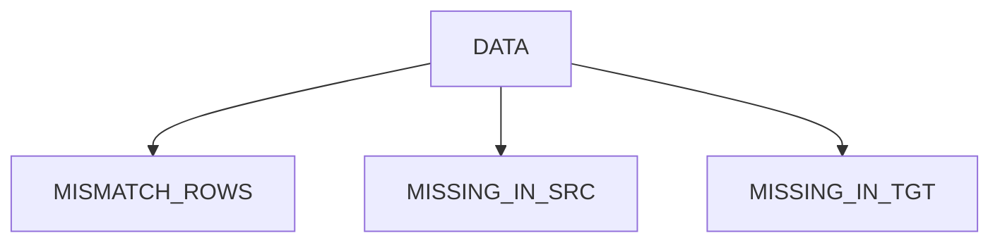
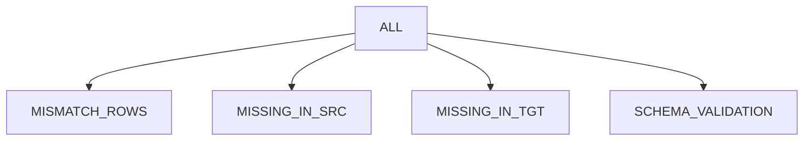

# Remorph Reconciliation

Remorph Reconciliation is a library that helps to reconcile the data, post data migration or during the data
migration   
between the source system and databricks system.It supports multiple types of reconciliation depending upon the user   
requirements and data in the source system.It makes the migration process simpler by removing the complex part of
validating the data from one system to another and enabling the team with more insights on the data migrated.

## Types of Report Supported:

| report type | sample visualisation                           | description                                                                                                                                                                               | key outputs                                                                                                                                                                                                                                                                                                                                                                                                                                                                                          |
|-------------|------------------------------------------------|-------------------------------------------------------------------------------------------------------------------------------------------------------------------------------------------|------------------------------------------------------------------------------------------------------------------------------------------------------------------------------------------------------------------------------------------------------------------------------------------------------------------------------------------------------------------------------------------------------------------------------------------------------------------------------------------------------|
| **schema**  | [schema](report_types_visualisation.md#schema) | reconcile the schema of source and target.<br> - are same if the source is same <br> - its compatible if the source is different                                                          | - **schema_comparison**<br>- **schema_difference**                                                                                                                                                                                                                                                                                                                                                                                                                                                   |
| **row**     | [row](report_types_visualisation.md#row)       | reconcile the data only at row level(hash value of the source row is matched with the hash value of the target).Preferred when there are no join columns identified b/w source and target.| - **missing_in_src**(sample rows in target that are not available in source + sample rows in target that doesn't match with source)<br> - **missing_in_tgt**(sample rows in target that are not available in target + sample rows in source that doesn't match with target)<br>  **NOTE**: the report won't differentiate the mismatch and missing here.                                                                                                                                             |
| **data**    | [data](report_types_visualisation.md#data)     | reconcile the data at row and column level- ```joining_keys``` will play the key role here                                                                                                | - **mismatch_data**(the sample data with mismatches captured at each column and row level )<br> - **missing_in_src**(sample rows that are available in target but missing in src)<br> - **missing_in_tgt**(sample rows that are available in source but are missing in target)<br> - **threshold_mismatch**(configured column will be reconciled based on percentile or threshold boundary or date boundary)<br> - **mismatch_columns**(consolidated list of columns that has mismatches in them)<br> |
| **all**     | [all](report_types_visualisation.md#all)       | this is a combination of data + schema                                                                                                                                                    | - **data + schema outputs**                                                                                                                                                                                                                                                                                                                                                                                                                                                                          |


## Installation

## Flow Chart for supported Report Type and Reconciliation Logics











## Supported Source System and Report Types

| Source     | Schema | Row | Data | All |
|------------|--------|-----|------|-----|
| Oracle     | Yes    | Yes | Yes  | Yes |
| Snowflake  | Yes    | Yes | Yes  | Yes |
| Databricks | Yes    | Yes | Yes  | Yes |

## Dependency CLI commands

TBD

## TABLE Config Elements:

```
@dataclass
class Table:
    source_name: str
    target_name: str
    join_columns: list[str] | None = None
    jdbc_reader_options: JdbcReaderOptions | None = None
    select_columns: list[str] | None = None
    drop_columns: list[str] | None = None
    column_mapping: list[ColumnMapping] | None = None
    transformations: list[Transformation] | None = None
    thresholds: list[Thresholds] | None = None
    filters: Filters | None = None
```

| config_name         | data_type             | description                                                                                                                                                                                                                      | required/optional      | example_value                                                                                                                                 |
|---------------------|-----------------------|----------------------------------------------------------------------------------------------------------------------------------------------------------------------------------------------------------------------------------|------------------------|-----------------------------------------------------------------------------------------------------------------------------------------------|
| source_name         | string                | name of the source table                                                                                                                                                                                                         | required               | product                                                                                                                                       |
| target_name         | string                | name of the target table                                                                                                                                                                                                         | required               | product                                                                                                                                       |
| join_columns        | list[string]          | list of column names or column name which acts as primary key to the table                                                                                                                                                       | optional(default=None) | ["product_id"] or ["product_id","order_id"]                                                                                                   |
| jdbc_reader_options | string                | jdbc_reader_option,that helps to parallelize the data read from jdbc sources based on the given configuration.For more info [jdbc_reader_options](#jdbc_reader_options)                                                          | optional(default=None) | "jdbc_reader_options": {"number_partitions": 10,"partition_column": "s_suppkey","upper_bound": "10000000","lower_bound": "10","fetch_size":"100"} |
| select_columns      | list[string]          | list of columns to be considered for the reconciliation process                                                                                                                                                                  | optional(default=None) | ["id","name","address"]                                                                                                                       |
| drop_columns        | list[string]          | list of columns to be eliminated from the reconciliation process                                                                                                                                                                 | optional(default=None) | ["comment"]                                                                                                                                   |
| column_mapping      | list[ColumnMapping]   | list of column_mapping,that helps in resolving column name mismatch b/w src and tgt eg: "id" in src  and "emp_id" in tgt.For more info [column_mapping](#column_mapping)                                                         | optional(default=None) | "column_mapping": [{"source_name": "id","target_name": "emp_id"}]                                                                             |
| transformations     | list[Transformations] | list of user-defined transformations ,that can be applied on src and tgt columns in case of any incompatibility data types or explicit transformation applied during migration.For more info [transformations](#transformations) | optional(default=None) | "transformations": [{"column_name": "s_address","source": "trim(s_address)","target": "trim(s_address)"}]                                     |
| thresholds          | list[Thresholds]      | list of threshold conditions, that can be applied on tgt columns to match the minor exceptions in data.It supports percentile,absolute, and date fields.For more info [thresholds](#thresholds)                                  | optional(default=None) | "thresholds": [{"column_name": "sal","lower_bound": "-5%","upper_bound": "5%","type": "int"}]                                                 |
| filters             | Filters               | filter expr that can be used to filter the data on src and tgt based on respective expressions                                                                                                                                   | optional(default=None) | "filters" : {"source":"lower(dept_name)>'it'" ,"target" : "lower(department_name)>'it'"}                                                      |

### jdbc_reader_options

```
@dataclass
class JdbcReaderOptions:
    number_partitions: int
    partition_column: str
    lower_bound: str
    upper_bound: str
    fetch_size: int = 100
```

| field_name        | data_type | description                                                                                                                                                                                                                                                                                                                                                                                                                                                           | required/optional       | example_value |
|-------------------|-----------|-----------------------------------------------------------------------------------------------------------------------------------------------------------------------------------------------------------------------------------------------------------------------------------------------------------------------------------------------------------------------------------------------------------------------------------------------------------------------|-------------------------|---------------|
| number_partitions | string    | the number of partitions for reading input data in parallel                                                                                                                                                                                                                                                                                                                                                                                                           | required                | "200"         |
| partition_column  | string    | Int/date/timestamp parameter defining the column used for partitioning, typically the primary key of the source table. Note that this parameter accepts only one column, especially crucial when dealing with a composite primary key. In such cases, provide the column with higher cardinality.                                                                                                                                                                     | required                | "employee_id  |
| upper_bound       | string    | integer or date or timestamp without time zone value as string), that should be set appropriately (usually the maximum value in case of non-skew data) so the data read from the source should be approximately equally distributed                                                                                                                                                                                                                                   | required                | "1"           |
| lower_bound       | string    | integer or date or timestamp without time zone value as string), that should be set appropriately (usually the minimum value in case of non-skew data) so the data read from the source should be approximately equally distributed                                                                                                                                                                                                                                   | required                | "100000"      |
| fetch_size        | string    | This parameter influences the number of rows fetched per round-trip between Spark and the JDBC database, optimizing data retrieval performance. Adjusting this option significantly impacts the efficiency of data extraction, controlling the volume of data retrieved in each fetch operation. More details on configuring fetchSize can be found [here](https://docs.databricks.com/en/connect/external-systems/jdbc.html#control-number-of-rows-fetched-per-query) | optional(default="100") | "10000"       |

### column_mapping

```
@dataclass
class ColumnMapping:
    source_name: str
    target_name: str
```

| field_name  | data_type | description        | required/optional | example_value   |
|-------------|-----------|--------------------|-------------------|-----------------|
| source_name | string    | source column name | required          | "dept_id"       |
| target_name | string    | target column name | required          | "department_id" |

### transformations

```
@dataclass
class Transformation:
    column_name: str
    source: str
    target: str | None = None
```

| field_name  | data_type | description                                                | required/optional | example_value                    |
|-------------|-----------|------------------------------------------------------------|-------------------|----------------------------------|
| column_name | string    | the column name on which the transformation to be applied  | required          | "s_address"                      |
| source      | string    | the transformation sql expr to be applied on source column | required          | "trim(s_address)" or "s_address" |
| target      | string    | the transformation sql expr to be applied on source column | required          | "trim(s_address)" or "s_address" |

### thresholds

```
@dataclass
class Thresholds:
    column_name: str
    lower_bound: str
    upper_bound: str
    type: str
```

| field_name  | data_type | description                                                                                                                                                                  | required/optional                  | example_value  |
|-------------|-----------|------------------------------------------------------------------------------------------------------------------------------------------------------------------------------|------------------------------------|----------------|
| column_name | string    | the column that should be considered for threshold reconciliation                                                                                                            | required                           | "product_discount" |
| lower_bound | string    | the lower bound of the difference between the source value and the target value                                                                                              | optional(default=0)                | -5%            | 
| upper_bound | string    | the upper bound of the difference between the source value and the target value                                                                                              | optional(default=0)                | 5%             |            
| type        | string    | user must specify the type of the column. integer is selected for columns of type integer or double, while timestamp is chosen for columns of either date or timestamp types | required("integer" or "timestamp") | "int"          |

### filters

```
@dataclass
class Filters:
    source: str | None = None
    target: str | None = None
```

| field_name | data_type | description                                       | required/optional      | example_value                |
|------------|-----------|---------------------------------------------------|------------------------|------------------------------|
| source     | string    | the sql expression to filter the data from source | optional(default=None) | "lower(dept_name)='finance'" |
| target     | string    | the sql expression to filter the data from target | optional(default=None) | "lower(dept_name)='finance'" |

### Key Considerations on Table Config:

1. The column names are always converted to lower case and considered for reconciliation.
2. Currently it doesn't support case insensitivity and doesn't have collation support
3. Table Transformation internally consider the default value as the column value. It doesn't apply any default
   transformations
   if not provided.
   ```eg:Transformation(column_name="address",source_name=None,target_name="trim(s_address)")```
   For the given example,
   the source transformation is None,so the raw value in the source is considered for reconciliation.
4. If no user transformation is provided for a given column in the configuration,by default depending on the source data
   type our reconciler will apply  
   default transformation on both source and target to get the matching hash value in source and target.Please find the
   detailed default transformations here.
5. Always the column reference to be source column names in all the configs,except **Transformations** and **Filters**
   as these are dialect specific sql expressions ,that are applied directly in the sql.
6. **Transformations** and **Filters** are always should be in their respective dialect sql expressions and the reconciler will not apply any logic
on top of this.

# Guidance for Oracle as source

## Driver

1. **Download `ojdbc8.jar` from Oracle:**
   Visit the [official Oracle website](https://www.oracle.com/database/technologies/appdev/jdbc-downloads.html) to
   acquire the `ojdbc8.jar` JAR file. This file is crucial for establishing connectivity between Databricks and Oracle
   databases.

2. **Install the JAR file on Databricks:**
   Upon completing the download, proceed to install the JAR file onto your Databricks cluster. Refer
   to [this page](https://docs.databricks.com/en/libraries/workspace-libraries.html#upload-a-jar-python-egg-or-python-wheel)
   for comprehensive instructions on how to upload a JAR file, Python egg, or Python wheel to your Databricks workspace.

3. This installation is a necessary step to enable seamless comparison between Oracle and Databricks, ensuring that the
   required Oracle JDBC functionality is readily available within the Databricks environment.

## Commonly Used Custom Transformations

| source_type | data_type     | source_transformation                                                | target_transformation                           | source_value_example | target_value_example | comments                                                                                    |
|-------------|---------------|----------------------------------------------------------------------|-------------------------------------------------|----------------------|----------------------|---------------------------------------------------------------------------------------------|
| oracle      | number(10,5)  | trim(to_char(coalesce(<col_name>,0.0), '99990.99999'))               | cast(coalesce(<col_name>,0.0) as decimal(10,5)) | 1.00                 | 1.00000              | this can be used for any precision and scale by adjusting accordingly in the transformation |
| snowflake   | array         | array_to_string(array_compact(<col_name>),',')                       | concat_ws(',', <col_name>)                      |                      |                      | in case of removing "undefined" during migration(converts sparse array to dense array)      |
| snowflake   | array         | array_to_string(array_sort(array_compact(<col_name>),true,true),',') | concat_ws(',', <col_name>)                      |                      |                      | in case of removing "undefined" during migration and want to sort the array                 |
| snowflake   | timestamp_ntz | date_part(epoch_second,<col_name>)                                   | unix_timestamp(<col_name>)                      |                      |                      | convert timestamp_ntz to epoch for getting a match b/w snowflake and databricks             |

## Data Reconciliation Examples:

For more Reconciliation Config examples ,please refer to [sample_notebook][link].

[link]: reconciliation-configs-examples.py

# Frequently Asked Questions(FAQS)

## Reconciler Questions

### Can we run reconcile for Databricks without UC as target?
```
Reconciliation target is always Databricks with UC enabled.Reconciler support non-uc databricks only as source.
```

### What would happen if my dataset has duplicate records?
```
Duplicates are not handled in the reconciler.If ran with duplicates,it would result in inconsistent output.We can implement
some workaround to handle the duplicates and this varies from dataset to dataset.
```

### Does User Transformations are applicable for Schema Validations?
```
No.User Transformations are not applied for Schema Validation.Only select_columns,drop_columns and column_mapping is
valid for schema validation.
```

### Can we apply Aggregate or multi-column transformations as user transformation?
```
No.Aggregate transformations or multi-column transformations are not supported.
```

### Does Reconciler supports all complex data types?
```
Not all complex data types are supported currently.Reconciler do support UDFs for complex datatypes.Please refer here
for examples.
```

### Does Reconciler support `Threshold Validation` for report type as `row`?
```
No.Threshold Validation is supported only for report type as `data` or `all`.Generally tables with primary keys.
```

## Common Error Codes:

TBD
