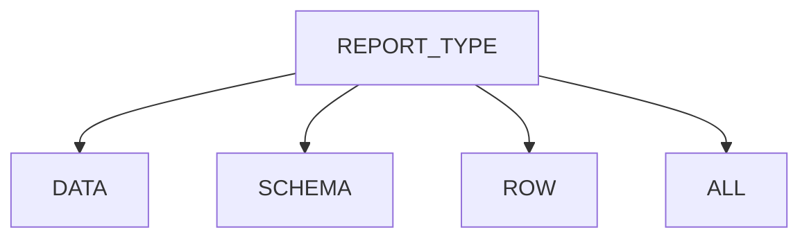
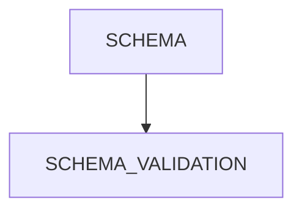
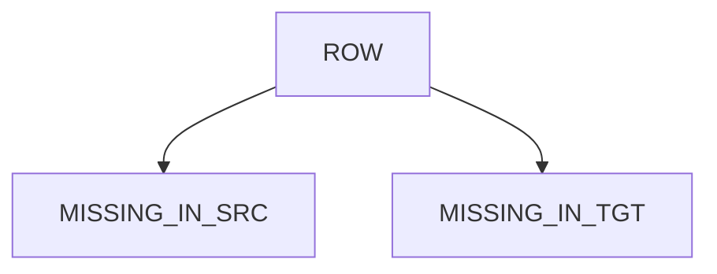
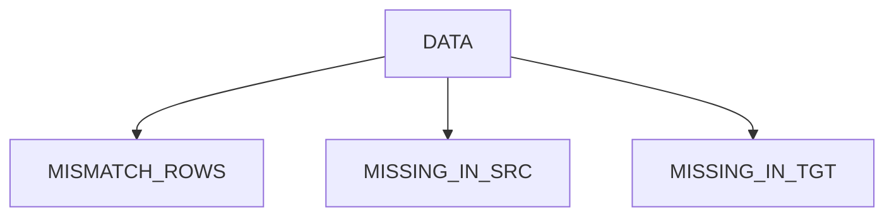
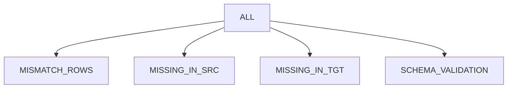

# Remorph Reconciliation

Reconcile is an automated tool designed to streamline the reconciliation process between source data and target data
residing on Databricks. Currently, the platform exclusively offers support for Snowflake, Oracle and other Databricks
tables as the primary data source. This tool empowers users to efficiently identify discrepancies and variations in data
when comparing the source with the Databricks target.

* [Types of Report Supported](#types-of-report-supported)
* [Report Type-Flow Chart](#report-type-flow-chart)
* [Supported Source System](#supported-source-system)
* [TABLE Config Elements](#table-config-elements)
    * [jdbc_reader_options](#jdbc_reader_options)
    * [column_mapping](#column_mapping)
    * [transformations](#transformations)
    * [thresholds](#thresholds)
    * [filters](#filters)
    * [Key Considerations](#key-considerations)
* [Reconciliation Examples](#reconciliation-examples)

## Types of Report Supported

| report type | sample visualisation                           | description                                                                                                                                                                                    | key outputs  captured in the recon metrics tables                                                                                                                                                                                                                                                                                                                                                                                                                                                        |
|-------------|------------------------------------------------|------------------------------------------------------------------------------------------------------------------------------------------------------------------------------------------------|----------------------------------------------------------------------------------------------------------------------------------------------------------------------------------------------------------------------------------------------------------------------------------------------------------------------------------------------------------------------------------------------------------------------------------------------------------------------------------------------------------|
| **schema**  | [schema](report_types_visualisation.md#schema) | reconcile the schema of source and target.<br>  - validate the datatype is same or compatible                                                                                                  | - **schema_comparison**<br>- **schema_difference**                                                                                                                                                                                                                                                                                                                                                                                                                                                       |
| **row**     | [row](report_types_visualisation.md#row)       | reconcile the data only at row level(hash value of the source row is matched with the hash value of the target).Preferred when there are no join columns identified between source and target. | - **missing_in_src**(sample rows that are available in target but missing in source + sample rows in the target that don't match with the source)<br> - **missing_in_tgt**(sample rows that are available in source but are missing in target + sample rows in the source that doesn't match with target)<br>  **NOTE**: the report won't differentiate the mismatch and missing here.                                                                                                                   |
| **data**    | [data](report_types_visualisation.md#data)     | reconcile the data at row and column level- ```join_columns``` will help us to identify mismatches at each row and column level                                                                | - **mismatch_data**(the sample data with mismatches captured at each column and row level )<br> - **missing_in_src**(sample rows that are available in target but missing in source)<br> - **missing_in_tgt**(sample rows that are available in source but are missing in target)<br> - **threshold_mismatch**(configured column will be reconciled based on percentile or threshold boundary or date boundary)<br> - **mismatch_columns**(consolidated list of columns that has mismatches in them)<br> |
| **all**     | [all](report_types_visualisation.md#all)       | this is a combination of data + schema                                                                                                                                                         | - **data + schema outputs**                                                                                                                                                                                                                                                                                                                                                                                                                                                                              |

[[back to top](#remorph-reconciliation)]

## Report Type-Flow Chart











[[back to top](#remorph-reconciliation)]

## Supported Source System

| Source     | Schema | Row | Data | All |
|------------|--------|-----|------|-----|
| Oracle     | Yes    | Yes | Yes  | Yes |
| Snowflake  | Yes    | Yes | Yes  | Yes |
| Databricks | Yes    | Yes | Yes  | Yes |

[[back to top](#remorph-reconciliation)]

### TABLE Config Elements:

<table>
<tr>
<th>Python</th>
<th>JSON</th>
</tr>
<tr>
<td>
<pre lang="python">
@dataclass
class Table:
    source_name: str
    target_name: str
    join_columns: list[str] | None = None
    jdbc_reader_options: JdbcReaderOptions | None = None
    select_columns: list[str] | None = None
    drop_columns: list[str] | None = None
    column_mapping: list[ColumnMapping] | None = None
    transformations: list[Transformation] | None = None
    thresholds: list[Thresholds] | None = None
    filters: Filters | None = None
</pre>
</td>
<td>
<pre lang="json">
{
  "source_name": "&lt;SOURCE_NAME&gt",
  "target_name": "&lt;TARGET_NAME&gt",
  "join_columns": ["&lt;COLUMN_NAME_1&gt","&lt;COLUMN_NAME_2&gt"],
  "jdbc_reader_options": null,
  "select_columns": null,
  "drop_columns": null,
  "column_mapping": null,
  "transformation": null,
  "thresholds": null,
  "filters": null
}
</pre>
</td>
</tr>
</table>


| config_name         | data_type             | description                                                                                                                                                                                                                        | required/optional      | example_value                                                                                                                                     |
|---------------------|-----------------------|------------------------------------------------------------------------------------------------------------------------------------------------------------------------------------------------------------------------------------|------------------------|---------------------------------------------------------------------------------------------------------------------------------------------------|
| source_name         | string                | name of the source table                                                                                                                                                                                                           | required               | product                                                                                                                                           |
| target_name         | string                | name of the target table                                                                                                                                                                                                           | required               | product                                                                                                                                           |
| join_columns        | list[string]          | list of column names which act as the primary key to the table                                                                                                                                                                     | optional(default=None) | ["product_id"] or ["product_id", "order_id"]                                                                                                      |
| jdbc_reader_options | string                | jdbc_reader_option, which helps to parallelise the data read from jdbc sources based on the given configuration.For more info [jdbc_reader_options](#jdbc_reader_options)                                                          | optional(default=None) | "jdbc_reader_options": {"number_partitions": 10,"partition_column": "s_suppkey","upper_bound": "10000000","lower_bound": "10","fetch_size":"100"} |
| select_columns      | list[string]          | list of columns to be considered for the reconciliation process                                                                                                                                                                    | optional(default=None) | ["id", "name", "address"]                                                                                                                         |
| drop_columns        | list[string]          | list of columns to be eliminated from the reconciliation process                                                                                                                                                                   | optional(default=None) | ["comment"]                                                                                                                                       |
| column_mapping      | list[ColumnMapping]   | list of column_mapping that helps in resolving column name mismatch between src and tgt, e.g., "id" in src and "emp_id" in tgt.For more info [column_mapping](#column_mapping)                                                     | optional(default=None) | "column_mapping": [{"source_name": "id","target_name": "emp_id"}]                                                                                 |
| transformations     | list[Transformations] | list of user-defined transformations that can be applied to src and tgt columns in case of any incompatibility data types or explicit transformation is applied during migration.For more info [transformations](#transformations) | optional(default=None) | "transformations": [{"column_name": "s_address","source": "trim(s_address)","target": "trim(s_address)"}]                                         |
| thresholds          | list[Thresholds]      | list of threshold conditions that can be applied on the columns to match the minor exceptions in data. It supports percentile, absolute, and date fields. For more info [thresholds](#thresholds)                                  | optional(default=None) | "thresholds": [{"column_name": "sal", "lower_bound": "-5%", "upper_bound": "5%", "type": "int"}]                                                  |
| filters             | Filters               | filter expr that can be used to filter the data on src and tgt based on respective expressions                                                                                                                                     | optional(default=None) | "filters": {"source": "lower(dept_name)>’ it’”, "target": "lower(department_name)>’ it’”}                                                         |

### jdbc_reader_options

<table>
<tr>
<th>Python</th>
<th>JSON</th>
</tr>
<tr>
<td>
<pre lang="python">
@dataclass
class JdbcReaderOptions:
    number_partitions: int
    partition_column: str
    lower_bound: str
    upper_bound: str
    fetch_size: int = 100
</pre>
</td>
<td>
<pre lang="json">
"jdbc_reader_options":{
  "number_partitions": "&lt;NUMBER_PARTITIONS&gt",
  "partition_column": "&lt;PARTITION_COLUMN&gt",
  "lower_bound": "&lt;LOWER_BOUND&gt",
  "upper_bound": "&lt;UPPER_BOUND&gt",
  "fetch_size": "&lt;FETCH_SIZE&gt"
}
</pre>
</td>
</tr>
</table>

| field_name        | data_type | description                                                                                                                                                                                                                                                                                                                                                                                                                                                             | required/optional       | example_value |
|-------------------|-----------|-------------------------------------------------------------------------------------------------------------------------------------------------------------------------------------------------------------------------------------------------------------------------------------------------------------------------------------------------------------------------------------------------------------------------------------------------------------------------|-------------------------|---------------|
| number_partitions | string    | the number of partitions for reading input data in parallel                                                                                                                                                                                                                                                                                                                                                                                                             | required                | "200"         |
| partition_column  | string    | Int/date/timestamp parameter defining the column used for partitioning, typically the primary key of the source table. Note that this parameter accepts only one column, which is especially crucial when dealing with a composite primary key. In such cases, provide the column with higher cardinality.                                                                                                                                                              | required                | "employee_id  |
| upper_bound       | string    | integer or date or timestamp without time zone value as string), that should be set appropriately (usually the maximum value in case of non-skew data) so the data read from the source should be approximately equally distributed                                                                                                                                                                                                                                     | required                | "1"           |
| lower_bound       | string    | integer or date or timestamp without time zone value as string), that should be set appropriately (usually the minimum value in case of non-skew data) so the data read from the source should be approximately equally distributed                                                                                                                                                                                                                                     | required                | "100000"      |
| fetch_size        | string    | This parameter influences the number of rows fetched per round-trip between Spark and the JDBC database, optimising data retrieval performance. Adjusting this option significantly impacts the efficiency of data extraction, controlling the volume of data retrieved in each fetch operation. More details on configuring fetch size can be found [here](https://docs.databricks.com/en/connect/external-systems/jdbc.html#control-number-of-rows-fetched-per-query) | optional(default="100") | "10000"       |

### column_mapping

<table>
<tr>
<th>Python</th>
<th>JSON</th>
</tr>
<tr>
<td>
<pre lang="python">

@dataclass
class ColumnMapping:
    source_name: str
    target_name: str
</pre>
</td>
<td>
<pre lang="json">
"column_mapping":[
  {
    "source_name": "&lt;SOURCE_COLUMN_NAME&gt",
    "target_name": "&lt;TARGET_COLUMN_NAME&gt"
  }
]
</pre>
</td>
</tr>
</table>

| field_name  | data_type | description        | required/optional | example_value   |
|-------------|-----------|--------------------|-------------------|-----------------|
| source_name | string    | source column name | required          | "dept_id"       |
| target_name | string    | target column name | required          | "department_id" |

### transformations

<table>
<tr>
<th>Python</th>
<th>JSON</th>
</tr>
<tr>
<td>
<pre lang="python">

@dataclass
class Transformation:
    column_name: str
    source: str
    target: str | None = None

</pre>
</td>
<td>
<pre lang="json">
"transformations":[
    {
      "column_name": "&lt;COLUMN_NAME&gt",
      "source": "&lt;TRANSFORMATION_EXPRESSION&gt",
      "target": "&lt;TRANSFORMATION_EXPRESSION&gt"
    }
]
</pre>
</td>
</tr>
</table>


| field_name  | data_type | description                                                | required/optional | example_value                    |
|-------------|-----------|------------------------------------------------------------|-------------------|----------------------------------|
| column_name | string    | the column name on which the transformation to be applied  | required          | "s_address"                      |
| source      | string    | the transformation sql expr to be applied on source column | required          | "trim(s_address)" or "s_address" |
| target      | string    | the transformation sql expr to be applied on source column | required          | "trim(s_address)" or "s_address" |

### Note:

Reconciliation also takes an udf in the transformation expr.Say for eg. we have a udf named sort_array_input() that takes an unsorted array as input and returns an array sorted.We can use that in transformation as below:

```
transformations=[Transformation(column_name)="array_col",source=sort_array_input(array_col),target=sort_array_input(array_col)]
```
## thresholds

<table>
<tr>
<th>Python</th>
<th>JSON</th>
</tr>
<tr>
<td>
<pre lang="python">

@dataclass
class Thresholds:
    column_name: str
    lower_bound: str
    upper_bound: str
    type: str

</pre>
</td>
<td>
<pre lang="json">
"thresholds":[
  {
    "column_name": "&lt;COLUMN_NAME&gt",
    "lower_bound": "&lt;LOWER_BOUND&gt",
    "upper_bound": "&lt;UPPER_BOUND&gt",
    "type": "&lt;DATA_TYPE&gt"
  }
]
</pre>
</td>
</tr>
</table>


| field_name  | data_type | description                                                                                                 | required/optional   | example_value      |
|-------------|-----------|-------------------------------------------------------------------------------------------------------------|---------------------|--------------------|
| column_name | string    | the column that should be considered for threshold reconciliation                                           | required            | "product_discount" |
| lower_bound | string    | the lower bound of the difference between the source value and the target value                             | optional(default=0) | -5%                | 
| upper_bound | string    | the upper bound of the difference between the source value and the target value                             | optional(default=0) | 5%                 |            
| type        | string    | The user must specify the column type. Supports SQLGLOT DataType.NUMERIC_TYPES and DataType.TEMPORAL_TYPES. | required            | int                |

### filters

<table>
<tr>
<th>Python</th>
<th>JSON</th>
</tr>
<tr>
<td>
<pre lang="python">
@dataclass
class Filters:
    source: str | None = None
    target: str | None = None
</pre>
</td>
<td>
<pre lang="json">
"filters":{
  "source": "&lt;FILTER_EXPRESSION&gt",
  "target": "&lt;FILTER_EXPRESSION&gt"
}
</pre>
</td>
</tr>
</table>


| field_name | data_type | description                                       | required/optional      | example_value                |
|------------|-----------|---------------------------------------------------|------------------------|------------------------------|
| source     | string    | the sql expression to filter the data from source | optional(default=None) | "lower(dept_name)='finance'" |
| target     | string    | the sql expression to filter the data from target | optional(default=None) | "lower(dept_name)='finance'" |

### Key Considerations:

1. The column names are always converted to lowercase and considered for reconciliation.
2. Currently, it doesn't support case insensitivity and doesn't have collation support
3. Table Transformation internally considers the default value as the column value. It doesn't apply any default
   transformations
   if not provided.
   ```eg:Transformation(column_name="address",source_name=None,target_name="trim(s_address)")```
   For the given example,
   the source transformation is None, so the raw value in the source is considered for reconciliation.
4. If no user transformation is provided for a given column in the configuration by default, depending on the source
   data
   type, our reconciler will apply  
   default transformation on both source and target to get the matching hash value in source and target. Please find the
   detailed default transformations here.
5. Always the column reference to be source column names in all the configs, except **Transformations** and **Filters**
   as these are dialect-specific SQL expressions that are applied directly in the SQL.
6. **Transformations** and **Filters** are always should be in their respective dialect SQL expressions, and the
   reconciler will not apply any logic
   on top of this.

[[back to top](#remorph-reconciliation)]

# Guidance for Oracle as a source

## Driver

### Option 1

* **Download `ojdbc8.jar` from Oracle:**
  Visit the [official Oracle website](https://www.oracle.com/database/technologies/appdev/jdbc-downloads.html) to
  acquire the `ojdbc8.jar` JAR file. This file is crucial for establishing connectivity between Databricks and Oracle
  databases.

* **Install the JAR file on Databricks:**
  Upon completing the download, install the JAR file onto your Databricks cluster. Refer
  to [this page](https://docs.databricks.com/en/libraries/cluster-libraries.html)
  For comprehensive instructions on uploading a JAR file, Python egg, or Python wheel to your Databricks workspace.

### Option 2

* **Install ojdbc8 library from Maven:**
  Follow [this guide](https://docs.databricks.com/en/libraries/package-repositories.html#maven-or-spark-package) to
  install the Maven library on a cluster. Refer
  to [this document](https://mvnrepository.com/artifact/com.oracle.database.jdbc/ojdbc8) for obtaining the Maven
  coordinates.

This installation is a necessary step to enable seamless comparison between Oracle and Databricks, ensuring that the
required Oracle JDBC functionality is readily available within the Databricks environment.

[[back to top](#remorph-reconciliation)]

## Commonly Used Custom Transformations

| source_type | data_type     | source_transformation                                                  | target_transformation                           | source_value_example    | target_value_example    | comments                                                                                    |
|-------------|---------------|------------------------------------------------------------------------|-------------------------------------------------|-------------------------|-------------------------|---------------------------------------------------------------------------------------------|
| Oracle      | number(10,5)  | trim(to_char(coalesce(<col_name>,0.0), ’99990.99999’))                 | cast(coalesce(<col_name>,0.0) as decimal(10,5)) | 1.00                    | 1.00000                 | this can be used for any precision and scale by adjusting accordingly in the transformation |
| Snowflake   | array         | array_to_string(array_compact(<col_name>),’,’)                         | concat_ws(’,’, <col_name>)                      | [1,undefined,2]         | [1,2]                   | in case of removing "undefined" during migration(converts sparse array to dense array)      |
| Snowflake   | array         | array_to_string(array_sort(array_compact(<col_name>), true, true),’,’) | concat_ws(’,’, <col_name>)                      | [2,undefined,1]         | [1,2]                   | in case of removing "undefined" during migration and want to sort the array                 |
| Snowflake   | timestamp_ntz | date_part(epoch_second,<col_name>)                                     | unix_timestamp(<col_name>)                      | 2020-01-01 00:00:00.000 | 2020-01-01 00:00:00.000 | convert timestamp_ntz to epoch for getting a match between Snowflake and data bricks        |

[[back to top](#remorph-reconciliation)]

## Reconciliation Example:

For more Reconciliation Config example, please refer to [sample config][link].

[link]: reconcile_config_samples.md

[[back to top](#remorph-reconciliation)]
