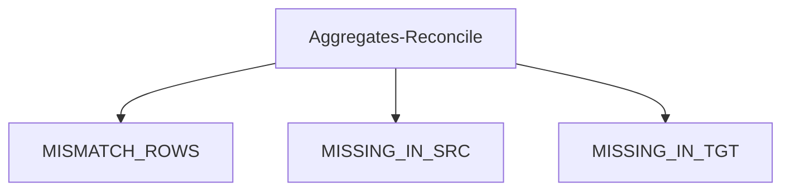

# Remorph Aggregates Reconciliation


Aggregates Reconcile is a utility to streamline the reconciliation process, specific aggregate metric is compared
between source and target data residing on Databricks.

## Summary

| operation_name           | sample visualisation                        | description                                                                                                                                               | key outputs  captured in the recon metrics tables                                                                                                                                                                                                                               |
|--------------------------|---------------------------------------------|-----------------------------------------------------------------------------------------------------------------------------------------------------------|---------------------------------------------------------------------------------------------------------------------------------------------------------------------------------------------------------------------------------------------------------------------------------|
| **aggregates-reconcile** | [data](visualisation.md#data) | reconciles the data for each aggregate metric - ```join_columns``` are used to identify the mismatches at aggregated metric level | - **mismatch_data**(sample data with mismatches captured at aggregated metric level )<br> - **missing_in_src**(sample rows that are available in target but missing in source)<br> - **missing_in_tgt**(sample rows that are available in source but are missing in target)<br> |


* [Supported Aggregate Functions](#supported-aggregate-functions)
* [Flow Chart](#flow-chart)
* [Supported Source Systems](#supported-source-systems)
* [TABLE Config Elements](#table-config-elements)
    * [Aggregate Attributes](#aggregate-attributes)
    * [Key Considerations](#key-considerations)
* [Aggregates Reconciliation Example](#aggregates-reconciliation-example)
* [DataFlow Example](#dataflow-example)


## Supported Aggregate Functions


| <a href="https://docs.databricks.com/en/sql/language-manual/sql-ref-functions-builtin.html#aggregate-functions" target="_blank"> Aggregate Functions </a> |
|-----------------------------------------------------------------------------------------------------------------------------------------------------------|
| <a href="https://docs.databricks.com/en/sql/language-manual/functions/min.html" target="_blank">**min**</a>                                               |  
| <a href="https://docs.databricks.com/en/sql/language-manual/functions/max.html" target="_blank">**max**</a>                                               |
| <a href="https://docs.databricks.com/en/sql/language-manual/functions/count.html" target="_blank">**count**</a>                                           |
| <a href="https://docs.databricks.com/en/sql/language-manual/functions/sum.html" target="_blank">**sum**</a>                                               |
| <a href="https://docs.databricks.com/en/sql/language-manual/functions/avg.html" target="_blank">**avg**</a>                                               |
| <a href="https://docs.databricks.com/en/sql/language-manual/functions/mean.html" target="_blank">**mean**</a>                                             |
| <a href="https://docs.databricks.com/en/sql/language-manual/functions/mode.html" target="_blank">**mode**</a>                                             |
| <a href="https://docs.databricks.com/en/sql/language-manual/functions/percentile.html" target="_blank">**percentile**</a>                                 |
| <a href="https://docs.databricks.com/en/sql/language-manual/functions/stddev.html" target="_blank">**stddev**</a>                                         |
| <a href="https://docs.databricks.com/en/sql/language-manual/functions/variance.html" target="_blank">**variance**</a>                                     |
| <a href="https://docs.databricks.com/en/sql/language-manual/functions/median.html" target="_blank">**median**</a>                                         |


[[back to top](#remorph-aggregates-reconciliation)]


## Flow Chart




[[back to top](#remorph-aggregates-reconciliation)]


## Supported Source Systems

All [source systems](../recon_configurations/README.md#supported-source-system) supported by reconcile

[[back to top](#remorph-aggregates-reconciliation)]


### TABLE Config Elements:

<table>
<tr>
<th>Python</th>
<th>JSON</th>
</tr>
<tr>
<td>
<pre lang="python">
@dataclass
class Table:
    source_name: str
    target_name: str
    <b>aggregates: list[Aggregate] | None = None</b>
    join_columns: list[str] | None = None
    jdbc_reader_options: JdbcReaderOptions | None = None
    select_columns: list[str] | None = None
    drop_columns: list[str] | None = None
    column_mapping: list[ColumnMapping] | None = None
    transformations: list[Transformation] | None = None
    column_thresholds: list[ColumnThresholds] | None = None
    filters: Filters | None = None
    table_thresholds: list[TableThresholds] | None = None
</pre>
</td>
<td>
<pre lang="json">
{
  "source_name": "&lt;SOURCE_NAME&gt",
  "target_name": "&lt;TARGET_NAME&gt",
  "join_columns": ["&lt;COLUMN_NAME_1&gt","&lt;COLUMN_NAME_2&gt"],
  "aggregates": [{
                        "type": "MIN",
                        "agg_columns": ["&lt;COLUMN_NAME_3&gt"],
                        "group_by_columns": ["&lt;GROUP_COLUMN_NAME&gt"]
                      },
                      {
                        "type": "MAX",
                        "agg_columns": ["&lt;COLUMN_NAME_4&gt"],
                      }],
  "jdbc_reader_options": null,
  "select_columns": null,
  "drop_columns": null,
  "column_mapping": null,
  "transformation": null,
  "column_thresholds": null,
  "filters": null,
  "table_thresholds": null
}
</pre>
</td>
</tr>
</table>


### Aggregate Attributes:

| config_name      | data_type    | description                                                           | required/optional      | example_value          |
|------------------|--------------|-----------------------------------------------------------------------|------------------------|------------------------|
| type             | string       | [Supported Aggregate Functions](#supported-aggregate-functions)       | required               | MIN                    |
| agg_columns      | list[string] | list of columns names on which aggregate function needs to be applied | required               | ["product_discount"]   |
| group_by_columns | list[string] | list of column names on which grouping needs  to be applied           | optional(default=None) | ["product_id"] or None |


[[back to top](#remorph-aggregates-reconciliation)]


### Key Considerations:

1. The aggregate column names, group by columns and type are always converted to lowercase and considered for reconciliation.
2. Currently, it doesn't support case insensitivity and does not have collation support
3. The queries with “group by” column(s) are compared based on the same group by columns.
4. The queries without “group by” column(s) are compared row-to-row.
5. Existing features like `column_mapping`, `transformations`, `JDBCReaderOptions` and `filters` are leveraged for the aggregate metric reconciliation.
6. Existing `select_columns` and `drop_columns` are not considered for the aggregate metric reconciliation.
7. Even though the user provides the `select_columns` and `drop_columns`, those are not considered.

[[back to top](#remorph-aggregates-reconciliation)]


## Aggregates Reconciliation Example

For more examples, please refer to [sample config][link].

[link]: aggregates_reconcile_config_samples.md

[[back to top](#remorph-aggregates-reconciliation)]


## DataFlow Example

Aggregates Reconcile Data [Visualisation](visualisation.md)

[[back to top](#remorph-aggregates-reconciliation)]