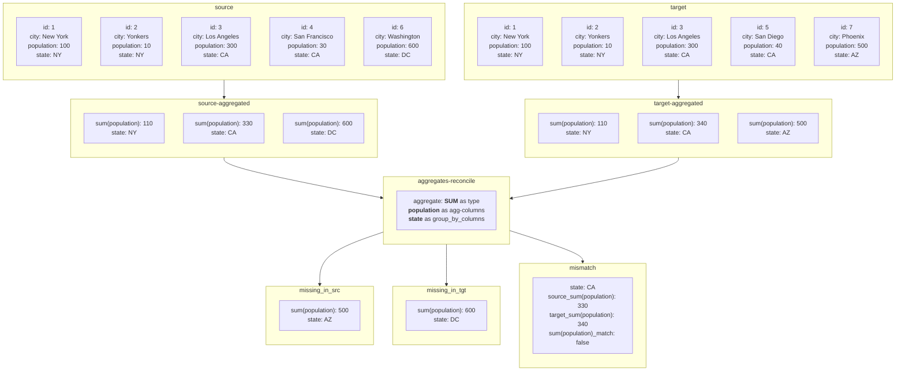
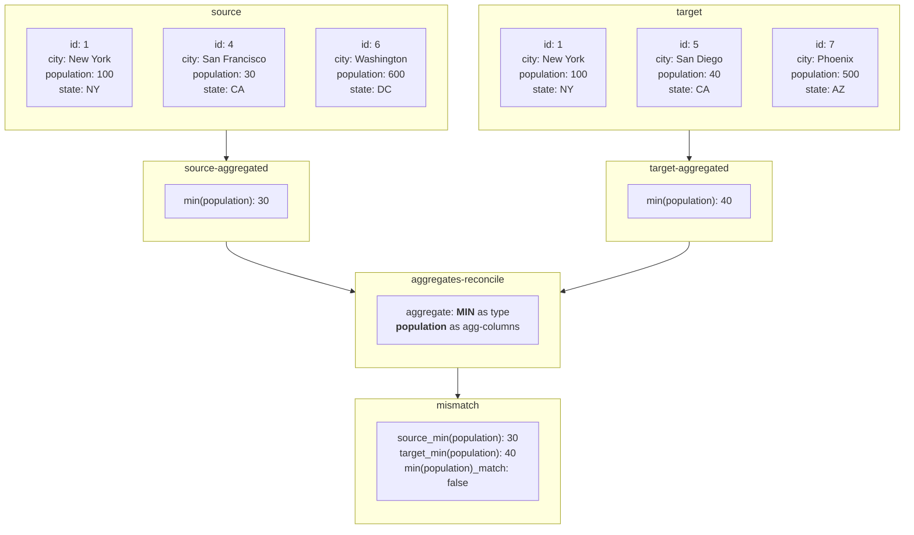

## data
###  with group by

```mermaid
flowchart TB
    subgraph source
        direction TB
        A["id: 1<br>city: New York<br>population: 100<br>state: NY"]
        B["id: 2<br>city: Yonkers<br>population: 10<br>state: NY"]
        C["id: 3<br>city: Los Angeles<br>population: 300<br>state: CA"]
        D["id: 4<br>city: San Francisco<br>population: 30<br>state: CA"]
        E["id: 6<br>city: Washington<br>population: 600<br>state: DC"]
    end

    subgraph target
        direction TB
        F["id: 1<br>city: New York<br>population: 100<br>state: NY"]
        G["id: 2<br>city: Yonkers<br>population: 10<br>state: NY"]
        H["id: 3<br>city: Los Angeles<br>population: 300<br>state: CA"]
        I["id: 5<br>city: San Diego<br>population: 40<br>state: CA"]
        J["id: 7<br>city: Phoenix<br>population: 500<br>state: AZ"]
    end

    subgraph source-aggregated
        direction TB
        K["sum(population): 110<br>state: NY"]
        L["sum(population): 330<br>state: CA"]
        M["sum(population): 600<br>state: DC"]
    end

    subgraph target-aggregated
        direction TB
        N["sum(population): 110<br>state: NY"]
        O["sum(population): 340<br>state: CA"]
        P["sum(population): 500<br>state: AZ"]
    end

    subgraph missing_in_src
        direction TB
        Q["sum(population): 500<br>state: AZ"]
    end

    subgraph missing_in_tgt
        direction TB
        R["sum(population): 600<br>state: DC"]
    end

    subgraph mismatch
        direction TB
        S["state: CA<br>source_sum(population): 330<br>target_sum(population): 340<br>sum(population)_match: false"]
    end

    subgraph aggregates-reconcile
        direction TB
        T["aggregate: <b>SUM</b> as type<br><b>population</b> as agg-columns<br><b>state</b> as group_by_columns"]
    end

    source --> source-aggregated
    target --> target-aggregated
    source-aggregated --> aggregates-reconcile
    target-aggregated --> aggregates-reconcile
    aggregates-reconcile --> missing_in_src
    aggregates-reconcile --> missing_in_tgt
    aggregates-reconcile --> mismatch
```

### without group by

```mermaid
flowchart TB
    subgraph source
        direction TB
        A["id: 1<br>city: New York<br>population: 100<br>state: NY"]
        D["id: 4<br>city: San Francisco<br>population: 30<br>state: CA"]
        E["id: 6<br>city: Washington<br>population: 600<br>state: DC"]
    end

    subgraph target
        direction TB
        F["id: 1<br>city: New York<br>population: 100<br>state: NY"]
        I["id: 5<br>city: San Diego<br>population: 40<br>state: CA"]
        J["id: 7<br>city: Phoenix<br>population: 500<br>state: AZ"]
    end

    subgraph source-aggregated
        direction TB
        K["min(population): 30"]
    end

    subgraph target-aggregated
        direction TB
        O["min(population): 40"]
    end


    subgraph mismatch
        direction TB
        S["source_min(population): 30<br>target_min(population): 40<br>min(population)_match: false"]
    end

    subgraph aggregates-reconcile
        direction TB
        T["aggregate: <b>MIN</b> as type<br><b>population</b> as agg-columns"]
    end

    source --> source-aggregated
    target --> target-aggregated
    source-aggregated --> aggregates-reconcile
    target-aggregated --> aggregates-reconcile
    aggregates-reconcile --> mismatch
```

