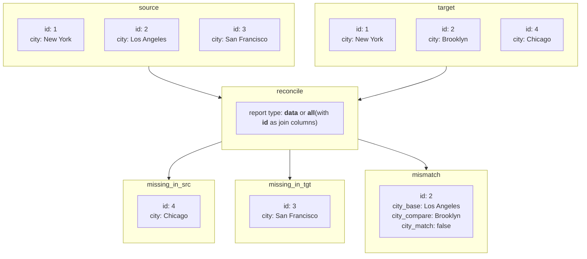
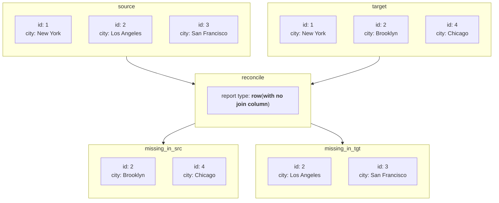
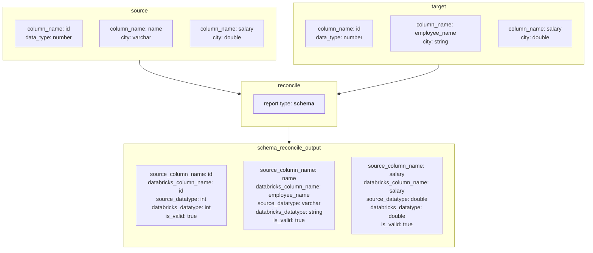
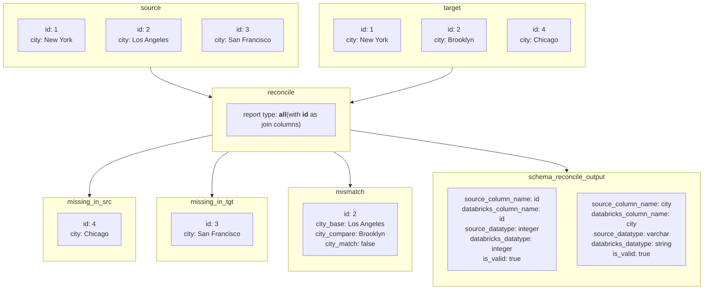

## data

```mermaid
flowchart TB
    subgraph source
        direction TB
        A["id: 1<br>city: New York"]
        B["id: 2<br>city: Los Angeles"]
        C["id: 3<br>city: San Francisco"]
    end

    subgraph target
        direction TB
        D["id: 1<br>city: New York"]
        E["id: 2<br>city: Brooklyn"]
        F["id: 4<br>city: Chicago"]
    end

    subgraph missing_in_src
        direction TB
        G["id: 4<br>city: Chicago"]
    end

    subgraph missing_in_tgt
        direction TB
        H["id: 3<br>city: San Francisco"]
    end

    subgraph mismatch
        direction TB
        I["id: 2<br>city_base: Los Angeles<br>city_compare: Brooklyn<br>city_match: false"]
    end

    subgraph reconcile
        direction TB
        J["report type: <b>data</b> or <b>all</b>(with <b>id</b> as join columns)"]
    end

    source --> reconcile
    target --> reconcile
    reconcile --> missing_in_src
    reconcile --> missing_in_tgt
    reconcile --> mismatch
```

## row

```mermaid
flowchart TB
    subgraph source
        direction TB
        A["id: 1<br>city: New York"]
        B["id: 2<br>city: Los Angeles"]
        C["id: 3<br>city: San Francisco"]
    end

    subgraph target
        direction TB
        D["id: 1<br>city: New York"]
        E["id: 2<br>city: Brooklyn"]
        F["id: 4<br>city: Chicago"]
    end

    subgraph missing_in_src
        direction TB
        G["id: 2<br>city: Brooklyn"]
        H["id: 4<br>city: Chicago"]
    end

    subgraph missing_in_tgt
        direction TB
        I["id: 2<br>city: Los Angeles"]
        J["id: 3<br>city: San Francisco"]
    end

    subgraph reconcile
        direction TB
        K["report type: <b>row</b>(<b>with no join column</b>)"]
    end

    source --> reconcile
    target --> reconcile
    reconcile --> missing_in_src
    reconcile --> missing_in_tgt
```

## schema

```mermaid
flowchart TB
    subgraph source
        direction TB
        A["column_name: id<br>data_type: number"]
        B["column_name: name<br>city: varchar"]
        C["column_name: salary<br>city: double"]
    end

    subgraph target
        direction TB
        D["column_name: id<br>data_type: number"]
        E["column_name: employee_name<br>city: string"]
        F["column_name: salary<br>city: double"]
    end

    subgraph reconcile
        direction TB
        G["report type: <b>schema</b>"]
    end

    subgraph schema_reconcile_output
        direction TB
        H["source_column_name: id<br>databricks_column_name: id<br>source_datatype: int<br>databricks_datatype: int<br>is_valid: true"]
        I["source_column_name: name<br>databricks_column_name: employee_name<br>source_datatype: varchar<br>databricks_datatype: string<br>is_valid: true"]
        J["source_column_name: salary<br>databricks_column_name: salary<br>source_datatype: double<br>databricks_datatype: double<br>is_valid: true"]
    end

    source --> reconcile
    target --> reconcile
    reconcile --> schema_reconcile_output
```

## all

```mermaid
flowchart TB
    subgraph source
        direction TB
        A["id: 1<br>city: New York"]
        B["id: 2<br>city: Los Angeles"]
        C["id: 3<br>city: San Francisco"]
    end

    subgraph target
        direction TB
        D["id: 1<br>city: New York"]
        E["id: 2<br>city: Brooklyn"]
        F["id: 4<br>city: Chicago"]
    end

    subgraph missing_in_src
        direction TB
        G["id: 4<br>city: Chicago"]
    end

    subgraph missing_in_tgt
        direction TB
        H["id: 3<br>city: San Francisco"]
    end

    subgraph mismatch
        direction TB
        I["id: 2<br>city_base: Los Angeles<br>city_compare: Brooklyn<br>city_match: false"]
    end

    subgraph schema_reconcile_output
        direction TB
        J["source_column_name: id<br>databricks_column_name: id<br>source_datatype: integer<br>databricks_datatype: integer<br>is_valid: true"]
        K["source_column_name: city<br>databricks_column_name: city<br>source_datatype: varchar<br>databricks_datatype: string<br>is_valid: true"]
    end

    subgraph reconcile
        direction TB
        L["report type: <b>all</b>(with <b>id</b> as join columns)"]
    end

    source --> reconcile
    target --> reconcile
    reconcile --> missing_in_src
    reconcile --> missing_in_tgt
    reconcile --> mismatch
    reconcile --> schema_reconcile_output
```

