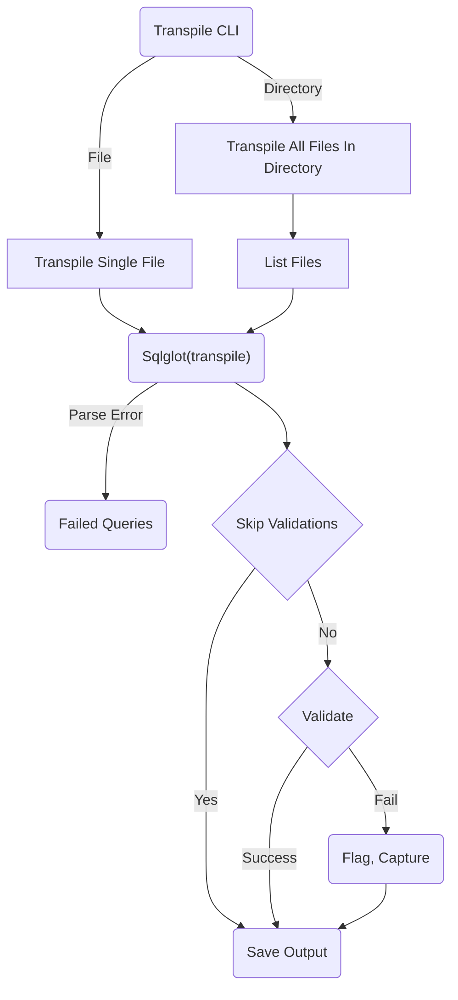

import useBaseUrl from '@docusaurus/useBaseUrl';

# Installation

Databricks Labs Remorph
---


-----

## [Table of Contents](#table-of-contents)

* [Remorph](#remorph)
* [Transpile](#transpile)
* [Reconcile](#reconcile)
* [Environment Setup](#environment-setup)
* [Install Transpile](#install-transpile)
* [Install Reconcile](#install-reconcile)

----
## Remorph
Remorph stands as a comprehensive toolkit meticulously crafted to facilitate seamless migrations to Databricks.
This suite of tools is dedicated to simplifying and optimizing the entire migration process, offering two distinctive functionalities – Transpile and Reconcile. Whether you are navigating code translation or resolving potential conflicts, Remorph ensures a smooth journey for any migration project. With Remorph as your trusted ally,
the migration experience becomes not only efficient but also well-managed, setting the stage for a successful transition to the Databricks platform.

## Transpile
Transpile is a self-contained SQL parser, transpiler, and validator designed to interpret a diverse range of SQL inputs and generate syntactically and semantically correct SQL in the Databricks SQL dialect. This tool serves as an automated solution, named Transpile, specifically crafted for migrating and translating SQL scripts from various sources to the Databricks SQL format. Currently, it exclusively supports Snowflake as a source platform, leveraging the open-source SQLglot.

Transpile stands out as a comprehensive and versatile SQL transpiler, boasting a robust test suite to ensure reliability. Developed entirely in Python, it not only demonstrates high performance but also highlights syntax errors and provides warnings or raises alerts for dialect incompatibilities based on configurations.

### Transpiler Design Flow:


## Reconcile
Reconcile is an automated tool designed to streamline the reconciliation process between source data and target data residing on Databricks. Currently, the platform exclusively offers support for Snowflake, Oracle and other  Databricks tables as the primary data source. This tool empowers users to efficiently identify discrepancies and variations in data when comparing the source with the Databricks target.

----

## Environment Setup
### Pre-requisites

1. `Databricks CLI` - Ensure that you have the Databricks Command-Line Interface (CLI) installed on your machine. Refer to the installation instructions provided for Linux, MacOS, and Windows, available [here](https://docs.databricks.com/en/dev-tools/cli/install.html#install-or-update-the-databricks-cli).

2. `Databricks CLI` - Configure the Databricks CLI by executing the following command with appropriate host and cluster details:
profile_name is optional, if not given it will use the default profile.
```shell
databricks configure --host <host> --configure-cluster --profile <profile_name>
```

3. `Python` - Verify that your machine has Python version 3.10 or later installed to meet the required dependencies for seamless operation.
- `Windows` - Install python from [here](https://www.python.org/downloads/). Your Windows computer will need a shell environment ([GitBash](https://www.git-scm.com/downloads) or [WSL](https://learn.microsoft.com/en-us/windows/wsl/about))
- `MacOS/Unix` - Use [brew](https://formulae.brew.sh/formula/python@3.10) to install python in macOS/Unix machines
#### Installing Databricks CLI on macOS


#### Install Databricks CLI via curl on Windows


#### Check Python version on Windows, macOS, and Unix


[[back to top](#table-of-contents)]

----

## Install Transpile

### Installation

Upon completing the environment setup, install Remorph by executing the following command:
```bash
databricks labs install remorph
```


### Verify Installation
Verify the successful installation by executing the provided command; confirmation of a successful installation is indicated when the displayed output aligns with the example screenshot provided:
```bash
 databricks labs remorph transpile --help
 ```


[[back to top](#table-of-contents)]

----

## Install Reconcile

### Installation

Install Reconciliation with databricks labs cli.

```commandline
databricks labs install remorph
```


### Verify Installation
Verify the successful installation by executing the provided command; confirmation of a successful installation is indicated when the displayed output aligns with the example screenshot provided:
```bash
 databricks labs remorph reconcile --help
 ```


[[back to top](#table-of-contents)]
