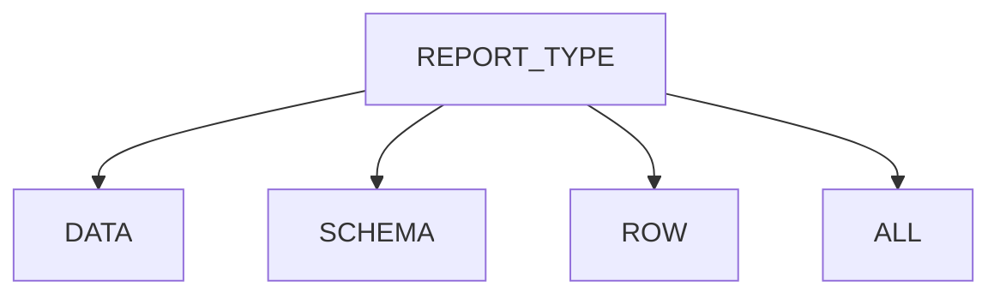
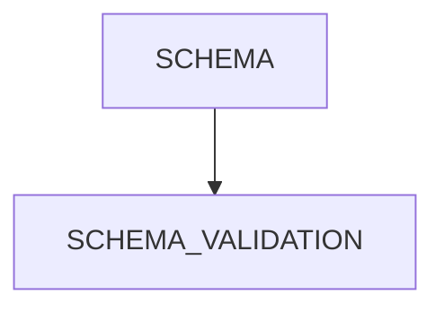
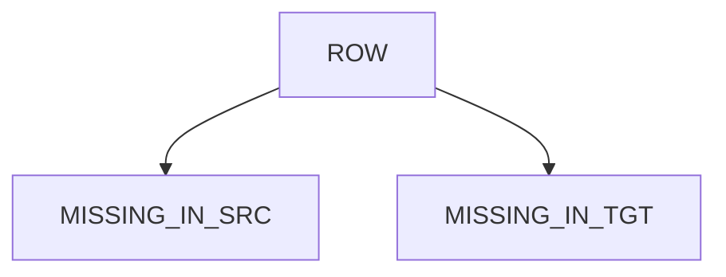
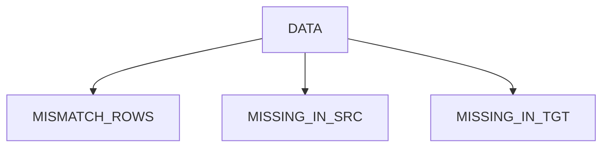
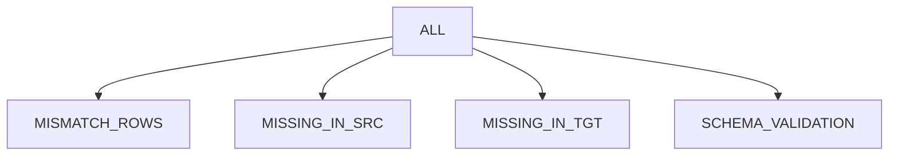
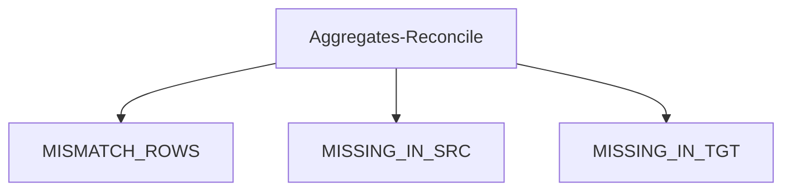

import useBaseUrl from '@docusaurus/useBaseUrl';
import Tabs from '@theme/Tabs';
import TabItem from '@theme/TabItem';
import CodeBlock from '@theme/CodeBlock';

## [Recon Config](#recon-config)

* [Types of Report Supported](#types-of-report-supported)
* [Report Type-Flow Chart](#report-type-flow-chart)
* [Supported Source System](#supported-source-system)
* [TABLE Config JSON filename](#table-config-json-filename)
* [TABLE Config Elements](#table-config-elements)
* [aggregates](#aggregate)
* [jdbc_reader_options](#jdbc_reader_options)
* [column_mapping](#column-mapping)
* [transformations](#transformations)
* [column_thresholds](#column-thresholds)
* [table_thresholds](#table-thresholds)
* [filters](#filters)
* [Aggregates Reconcile](#remorph-aggregates-reconciliation)
  * [Supported Aggregate Functions](#supported-aggregate-functions)
  * [Flow Chart](#flow-chart)
  * [Aggregate](#aggregate)
  * [TABLE Config Examples](#table-config-examples)

## Types of Report Supported

| report type | sample visualisation                 | description                                                                                                                                                                                    | key outputs  captured in the recon metrics tables                                                                                                                                                                                                                                                                                                                                                                                                                                                                  |
|-------------|--------------------------------------|------------------------------------------------------------------------------------------------------------------------------------------------------------------------------------------------|--------------------------------------------------------------------------------------------------------------------------------------------------------------------------------------------------------------------------------------------------------------------------------------------------------------------------------------------------------------------------------------------------------------------------------------------------------------------------------------------------------------------|
| **schema**  | [schema](../dataflow_example#schema) | reconcile the schema of source and target.<br />  - validate the datatype is same or compatible                                                                                                | - **schema_comparison**<br />- **schema_difference**                                                                                                                                                                                                                                                                                                                                                                                                                                                               |
| **row**     | [row](../dataflow_example#row)       | reconcile the data only at row level(hash value of the source row is matched with the hash value of the target).Preferred when there are no join columns identified between source and target. | - **missing_in_src**(sample rows that are available in target but missing in source + sample rows in the target that don't match with the source)<br /> - **missing_in_tgt**(sample rows that are available in source but are missing in target + sample rows in the source that doesn't match with target)<br />  **NOTE**: the report won't differentiate the mismatch and missing here.                                                                                                                         |
| **data**    | [data](../dataflow_example#data)     | reconcile the data at row and column level- ```join_columns``` will help us to identify mismatches at each row and column level                                                                | - **mismatch_data**(the sample data with mismatches captured at each column and row level )<br /> - **missing_in_src**(sample rows that are available in target but missing in source)<br /> - **missing_in_tgt**(sample rows that are available in source but are missing in target)<br /> - **threshold_mismatch**(configured column will be reconciled based on percentile or threshold boundary or date boundary)<br /> - **mismatch_columns**(consolidated list of columns that has mismatches in them)<br /> |
| **all**     | [all](../dataflow_example#all)       | this is a combination of data + schema                                                                                                                                                         | - **data + schema outputs**                                                                                                                                                                                                                                                                                                                                                                                                                                                                                        |

[[back to top](#recon-config)]

## Report Type-Flow Chart
---


---


---


---


---


---

[[back to top](#recon-config)]

## Supported Source System

| Source     | Schema | Row | Data | All |
|------------|--------|-----|------|-----|
| Oracle     | Yes    | Yes | Yes  | Yes |
| Snowflake  | Yes    | Yes | Yes  | Yes |
| Databricks | Yes    | Yes | Yes  | Yes |

[[back to top](#recon-config)]

### TABLE Config Json filename:
The config file must be named as `recon_config_[DATA_SOURCE]_[SOURCE_CATALOG_OR_SCHEMA]_[REPORT_TYPE].json` and should be placed in the remorph root directory `.remorph` within the Databricks Workspace.

> The filename pattern would remain the same for all the data_sources.

``` shell
recon_config_${DATA_SOURCE}_${SOURCE_CATALOG_OR_SCHEMA}_${REPORT_TYPE}.json
```

Please find the `Table Recon` filename examples below for the `Snowflake`, `Oracle`, and `Databricks` source systems.

<Tabs>
    <TabItem value="snowflake" label="Snowflake" default>
        ``` yaml title="recon_config_snowflake_sample_data_all.json"
        database_config:
          source_catalog: sample_data
          source_schema: default
          ...
        metadata_config:
          ...
        data_source: snowflake
        report_type: all
        ...
        ```
    </TabItem>
    <TabItem value="oracle" label="Oracle">
        ``` yaml title="recon_config_oracle_orc_data.json"
        database_config:
          source_schema: orc
          ...
        metadata_config:
          ...
        data_source: oracle
        report_type: data
        ...
        ```

    </TabItem>
    <TabItem value="databricks" label="Databricks">
        ``` yaml title="recon_config_databricks_hms_schema.json"
        database_config:
          source_schema: hms
          ...
        metadata_config:
          ...
        data_source: databricks
        report_type: schema
        ...
        ```
    </TabItem>
</Tabs>


> **Note:** the filename must be created in the same case as [SOURCE_CATALOG_OR_SCHEMA] is defined.
> For example, if the source schema is defined as `ORC` in the `reconcile` config, the filename should be `recon_config_oracle_ORC_data.json`.


[[back to top](#recon-config)]


### TABLE Config Elements:

<Tabs>
    <TabItem value="python" label="Python" default>
        ```python
        @dataclass
        class Table:
        source_name: str
        target_name: str
        aggregates: list[Aggregate] | None = None
        join_columns: list[str] | None = None
        jdbc_reader_options: JdbcReaderOptions | None = None
        select_columns: list[str] | None = None
        drop_columns: list[str] | None = None
        column_mapping: list[ColumnMapping] | None = None
        transformations: list[Transformation] | None = None
        column_thresholds: list[ColumnThresholds] | None = None
        filters: Filters | None = None
        table_thresholds: list[TableThresholds] | None = None
        ```
    </TabItem>
    <TabItem value="json" label="Json">
        ```json
        {
            "source_name": "[SOURCE_NAME]",
            "target_name": "[TARGET_NAME]",
            "aggregates": null,
            "join_columns": ["COLUMN_NAME_1","COLUMN_NAME_2"],
            "jdbc_reader_options": null,
            "select_columns": null,
            "drop_columns": null,
            "column_mapping": null,
            "transformation": null,
            "column_thresholds": null,
            "filters": null,
            "table_thresholds": null
        }
        ```


    </TabItem>
</Tabs>

### Configuration Reference

| Configuration Parameter | Data Type                | Description                                                                    | Requirement | Example Value                                                                                                                                           |
|-------------------------|--------------------------|--------------------------------------------------------------------------------|-------------|---------------------------------------------------------------------------------------------------------------------------------------------------------|
| `source_name`           | `string`                 | Source table name                                                              | Required    | <CodeBlock language="json">{`{"source_name": "product"}`}</CodeBlock>                                                                                   |
| `target_name`           | `string`                 | Target table name                                                              | Required    | <CodeBlock language="json">{`{"source_name": "product"}`}</CodeBlock>                                                                                   |
| `aggregates`            | `list[Aggregate]`        | List of aggregation rules (see [Aggregate](#aggregate))                        | Optional    | <CodeBlock language="json">{`{"aggregates": {"type": "MAX", "agg_columns": ["price"]}}`}</CodeBlock>                                                    |
| `join_columns`          | `list[string]`           | Primary key columns                                                            | Optional    | <CodeBlock language="json">{`{"join_columns": ["product_id", "order_id"]}`}</CodeBlock>                                                                 |
| `jdbc_reader_options`   | `object`                 | JDBC read parallelization configuration                                        | Optional    | <CodeBlock language="json">{`{"jdbc_reader_options": {"number_partitions": 10, "partition_column": "id", "fetch_size": 1000}}`}</CodeBlock>             |
| `select_columns`        | `list[string]`           | Columns to include in reconciliation                                           | Optional    | <CodeBlock language="json">{`{"select_columns": ["id", "name", "price"]}`}</CodeBlock>                                                                  |
| `drop_columns`          | `list[string]`           | Columns to exclude from reconciliation                                         | Optional    | <CodeBlock language="json">{`{"drop_columns": ["temp_sku"]}`}</CodeBlock>                                                                               |
| `column_mapping`        | `list[ColumnMapping]`    | Source-target column mapping (see [column_mapping](#column-mapping))           | Optional    | <CodeBlock language="json">{`{"column_mapping": {"source_name": "id", "target_name": "product_id"}}`}</CodeBlock>                                       |
| `transformations`       | `list[Transformations]`  | Column transformation rules (see [transformations](#transformations))          | Optional    | <CodeBlock language="json">{`{"transformations": {"column_name": "address", "source": "TRIM(address)", "target": "LOWER(TRIM(address))"}}`}</CodeBlock> |
| `column_thresholds`     | `list[ColumnThresholds]` | Column-level variance thresholds (see [column_thresholds](#column-thresholds)) | Optional    | <CodeBlock language="json">{`{"column_thresholds": {"column_name": "price", "lower_bound": "-5%", "upper_bound": "+10%"}}`}</CodeBlock>                 |
| `table_thresholds`      | `list[TableThresholds]`  | Table-level mismatch thresholds (see [table_thresholds](#table-thresholds))    | Optional    | <CodeBlock language="json">{`{"table_thresholds": {"model": "mismatch", "lower_bound": "0%", "upper_bound": "5%"}}`}</CodeBlock>                        |
| `filters`               | `Filters`                | Source/target filter expressions                                               | Optional    | <CodeBlock language="json">{`{"filters": {"source": "quantity > 100", "target": "stock_quantity >= 100"}}`}</CodeBlock>                                 |

[[back to top](#recon-config)]

### jdbc_reader_options

<Tabs>
  <TabItem value="python" label="Python" default>
    ```python
    @dataclass
    class JdbcReaderOptions:
        number_partitions: int
        partition_column: str
        lower_bound: str
        upper_bound: str
        fetch_size: int = 100
    ```
  </TabItem>
  <TabItem value="json" label="JSON">
    ```json
      "jdbc_reader_options": {
          "number_partitions": "<NUMBER_PARTITIONS>",
          "partition_column": "<PARTITION_COLUMN>",
          "lower_bound": "<LOWER_BOUND>",
          "upper_bound": "<UPPER_BOUND>",
          "fetch_size": "<FETCH_SIZE>"
  }
    ```
  </TabItem>
</Tabs>

| field_name        | data_type | description                                                                                                                                                                                                                                                                                                                                                                                                                                                             | required/optional       | example_value |
|-------------------|-----------|-------------------------------------------------------------------------------------------------------------------------------------------------------------------------------------------------------------------------------------------------------------------------------------------------------------------------------------------------------------------------------------------------------------------------------------------------------------------------|-------------------------|---------------|
| number_partitions | string    | the number of partitions for reading input data in parallel                                                                                                                                                                                                                                                                                                                                                                                                             | required                | "200"         |
| partition_column  | string    | Int/date/timestamp parameter defining the column used for partitioning, typically the primary key of the source table. Note that this parameter accepts only one column, which is especially crucial when dealing with a composite primary key. In such cases, provide the column with higher cardinality.                                                                                                                                                              | required                | "employee_id" |
| upper_bound       | string    | integer or date or timestamp without time zone value as string), that should be set appropriately (usually the maximum value in case of non-skew data) so the data read from the source should be approximately equally distributed                                                                                                                                                                                                                                     | required                | "1"           |
| lower_bound       | string    | integer or date or timestamp without time zone value as string), that should be set appropriately (usually the minimum value in case of non-skew data) so the data read from the source should be approximately equally distributed                                                                                                                                                                                                                                     | required                | "100000"      |
| fetch_size        | string    | This parameter influences the number of rows fetched per round-trip between Spark and the JDBC database, optimising data retrieval performance. Adjusting this option significantly impacts the efficiency of data extraction, controlling the volume of data retrieved in each fetch operation. More details on configuring fetch size can be found [here](https://docs.databricks.com/en/connect/external-systems/jdbc.html#control-number-of-rows-fetched-per-query) | optional(default="100") | "10000"       |


:::tip
#### Key Considerations for Oracle JDBC Reader Options:
For Oracle source, the following Spark Configurations are automatically set:
```json
"oracle.jdbc.mapDateToTimestamp": "False",
"sessionInitStatement": "BEGIN dbms_session.set_nls('nls_date_format', '''YYYY-MM-DD''');dbms_session.set_nls('nls_timestamp_format', '''YYYY-MM-DD HH24:MI:SS''');END;"
```

While configuring Recon for Oracle source, the above options should be taken into consideration.
:::

[[back to top](#recon-config)]

### column mapping

<Tabs>
  <TabItem value="python" label="Python" default>
    ```python
    @dataclass
    class ColumnMapping:
        source_name: str
        target_name: str
    ```
  </TabItem>
  <TabItem value="json" label="JSON">
    ```json
    "column_mapping": [
      {
        "source_name": "<SOURCE_COLUMN_NAME>",
        "target_name": "<TARGET_COLUMN_NAME>"
      }
    ]
    ```
  </TabItem>
</Tabs>

| field_name  | data_type | description        | required/optional | example_value   |
|-------------|-----------|--------------------|-------------------|-----------------|
| source_name | string    | source column name | required          | "dept_id"       |
| target_name | string    | target column name | required          | "department_id" |


### transformations

<Tabs>
  <TabItem value="python" label="Python" default>
    ```python
    @dataclass
    class Transformation:
        column_name: str
        source: str
        target: str | None = None
    ```
  </TabItem>
  <TabItem value="json" label="JSON">
    ```json
    "transformations": [
      {
        "column_name": "<COLUMN_NAME>",
        "source": "<TRANSFORMATION_EXPRESSION>",
        "target": "<TRANSFORMATION_EXPRESSION>"
      }
    ]
    ```
  </TabItem>
</Tabs>

| field_name  | data_type | description                                                | required/optional | example_value                    |
|-------------|-----------|------------------------------------------------------------|-------------------|----------------------------------|
| column_name | string    | the column name on which the transformation to be applied  | required          | "s_address"                      |
| source      | string    | the transformation sql expr to be applied on source column | required          | "trim(s_address)" or "s_address" |
| target      | string    | the transformation sql expr to be applied on source column | required          | "trim(s_address)" or "s_address" |


:::note
Reconciliation also takes an udf in the transformation expr.Say for eg. we have a udf named sort_array_input() that takes an unsorted array as input and returns an array sorted.We can use that in transformation as below:
``` json
transformations=[Transformation(column_name)="array_col",source=sort_array_input(array_col),target=sort_array_input(array_col)]
```
`NULL` values are defaulted to `_null_recon_` using the transformation expressions in these files:

1. [expression_generator.py](https://github.com/databrickslabs/remorph/tree/main/src/databricks/labs/remorph/reconcile/query_builder/expression_generator.py)
2. [sampling_query.py](https://github.com/databrickslabs/remorph/tree/main/src/databricks/labs/remorph/reconcile/query_builder/sampling_query.py).
If User is looking for any specific behaviour, they can override these rules using [transformations](#transformations) accordingly.
:::

:::danger
### Handling Nulls

While applying transformations, make sure you handle the nulls explicitly in the transformation column.
While Recon takes care of null handling for all the other columns (including join keys and other keys that are not included in drop_column list),
when users introduce transformation columns, recon uses those expressions as is. So you would have to include null handling in the transformation expression itself.

So if you are planning on using the below expression:
``` sql
cast( cast(scanout_units as decimal(38,10)) as string)
```

Use the below expression instead:

``` sql
coalesce(cast( cast(scanout_units as decimal(38,10)) as string), '_null_recon_')
```


### Handling Timestamp

A recommended approach to dealing with timestamps is to convert them to corresponding unix epoch string values.

``` python
Transformation(
column_name='schedule_interval_days',
source="coalesce(cast(DATE_PART(EPOCH_SECOND, schedule_interval_days) as timestamp), '_null_recon_')",
target='coalesce(cast(unix_timestamp(cast(schedule_interval_days as string)) as timestamp), "_null_recon_"'
),
```

:::

<table>
    <tr>
        <th colspan="4">Transformation Expressions</th>
    </tr>
    <tr>
        <th>filename</th>
        <th>function / variable</th>
        <th>transformation_rule</th>
        <th>description</th>
    </tr>
    <tr>
        <td>sampling_query.py</td>
        <td>_get_join_clause</td>
        <td>transform(coalesce, default="_null_recon_", is_string=True)</td>
        <td>Applies the coalesce transformation function for String column and defaults to `_null_recon_` if column is NULL</td>
    </tr>
    <tr>
        <td>expression_generator.py</td>
        <td>DataType_transform_mapping</td>
        <td>(coalesce, default='_null_recon_', is_string=True)</td>
        <td>Default String column Transformation rule for all dialects. Applies the coalesce transformation function and defaults to `_null_recon_` if column is NULL</td>
    </tr>
    <tr>
        <td>expression_generator.py</td>
        <td>DataType_transform_mapping</td>
        <td>"oracle": DataType...NCHAR: ..."NVL(TRIM(TO_CHAR..,'_null_recon_')"</td>
        <td>Transformation rule for oracle dialect 'NCHAR' datatype. Applies TO_CHAR, TRIM transformation functions. If column is NULL, then  defaults to `_null_recon_` </td>
    </tr>
    <tr>
        <td>expression_generator.py</td>
        <td>DataType_transform_mapping</td>
        <td>"oracle": DataType...NVARCHAR: ..."NVL(TRIM(TO_CHAR..,'_null_recon_')"</td>
        <td>Transformation rule for oracle dialect 'NVARCHAR' datatype. Applies TO_CHAR, TRIM transformation functions. If column is NULL, then  defaults to `_null_recon_` </td>
    </tr>
</table>


### column thresholds

<Tabs>
  <TabItem value="python" label="Python" default>
    ```python
    @dataclass
    class ColumnThresholds:
        column_name: str
        lower_bound: str
        upper_bound: str
        type: str
    ```
  </TabItem>
  <TabItem value="json" label="JSON">
    ```json
    "column_thresholds": [
      {
        "column_name": "COLUMN_NAME",
        "lower_bound": "LOWER_BOUND",
        "upper_bound": "UPPER_BOUND",
        "type": "DATA_TYPE"
      }

    ]
    ```
  </TabItem>
</Tabs>


| field_name  | data_type | description                                                                                                     | required/optional | example_value      |
|-------------|-----------|-----------------------------------------------------------------------------------------------------------------|-------------------|--------------------|
| column_name | string    | the column that should be considered for column threshold reconciliation                                        | required          | "product_discount" |
| lower_bound | string    | the lower bound of the difference between the source value and the target value                                 | required          | "-5%"              |
| upper_bound | string    | the upper bound of the difference between the source value and the target value                                 | required          | "5%"               |
| type        | string    | The user must specify the column type. Supports SQLGLOT `DataType.NUMERIC_TYPES` and `DataType.TEMPORAL_TYPES`. | required          | "int"              |

### table thresholds

<Tabs>
  <TabItem value="python" label="Python" default>
    ```python
    @dataclass
    class TableThresholds:
        lower_bound: str
        upper_bound: str
        model: str
    ```
  </TabItem>
  <TabItem value="json" label="JSON">
    ```json
    "table_thresholds": [
      {
        "lower_bound": "LOWER_BOUND",
        "upper_bound": "UPPER_BOUND",
        "model": "MODEL"
      }
    ]
    ```
  </TabItem>
</Tabs>

* The threshold bounds for the table must be non-negative, with the lower bound not exceeding the upper bound.

| field_name  | data_type | description                                                                                          | required/optional | example_value |
|-------------|-----------|------------------------------------------------------------------------------------------------------|-------------------|---------------|
| lower_bound | string    | the lower bound of the difference between the source mismatch and the target mismatch count          | required          | 0%            |
| upper_bound | string    | the upper bound of the difference between the source mismatch and the target mismatch count          | required          | 5%            |
| model       | string    | The user must specify on which table model it should be applied; for now, we support only "mismatch" | required          | int           |


### filters

<Tabs>
  <TabItem value="python" label="Python" default>
    ```python
    @dataclass
    class Filters:
        source: str
        target: str
    ```
  </TabItem>
  <TabItem value="json" label="JSON">
    ```json
    "filters": {
      "source": "FILTER_EXPRESSION",
      "target": "FILTER_EXPRESSION"
    }
    ```
  </TabItem>
</Tabs>

| field_name | data_type | description                                       | required/optional      | example_value                                                      |
|------------|-----------|---------------------------------------------------|------------------------|--------------------------------------------------------------------|
| source     | string    | the sql expression to filter the data from source | optional(default=None) | <CodeBlock language="sql">"lower(dept_name)='finance'"</CodeBlock> |
| target     | string    | the sql expression to filter the data from target | optional(default=None) | <CodeBlock language="sql">"lower(dept_name)='finance'"</CodeBlock> |


:::note Key Considerations:

1. The column names are always converted to lowercase and considered for reconciliation.
2. Currently, it doesn't support case insensitivity and doesn't have collation support
3. Table Transformation internally considers the default value as the column value. It doesn't apply any default
transformations
if not provided.
```eg:Transformation(column_name="address",source_name=None,target_name="trim(s_address)")```
For the given example,
the source transformation is None, so the raw value in the source is considered for reconciliation.
4. If no user transformation is provided for a given column in the configuration by default, depending on the source
data
type, our reconciler will apply
default transformation on both source and target to get the matching hash value in source and target. Please find the
detailed default transformations here.
5. Always the column reference to be source column names in all the configs, except **Transformations** and **Filters**
as these are dialect-specific SQL expressions that are applied directly in the SQL.
6. **Transformations** and **Filters** are always should be in their respective dialect SQL expressions, and the
reconciler will not apply any logic
on top of this.
:::

[[back to top](#recon-config)]

## Remorph Aggregates Reconciliation

Aggregates Reconcile is an utility to streamline the reconciliation process, specific aggregate metric is compared
between source and target data residing on Databricks.

### Summary

| operation_name           | sample visualisation                                                                | description                                                                                                                 | key outputs  captured in the recon metrics tables                                                                                                                                                                                                 |
|--------------------------|-------------------------------------------------------------------------------------|-----------------------------------------------------------------------------------------------------------------------------|---------------------------------------------------------------------------------------------------------------------------------------------------------------------------------------------------------------------------------------------------|
| **aggregates-reconcile** | `[data]({useBaseUrl('docs/reconcile/aggregates_reconcile_visualisation.md#data`)})` | reconciles the data for each aggregate metric `join_columns` are used to identify the mismatches at aggregated metric level | mismatch_data(sample data with mismatches captured at aggregated metric level ) missing_in_src(sample rows that are available in target but missing in source) missing_in_tgt(sample rows that are available in source but are missing in target) |


## Supported Aggregate Functions


| <a href="https://docs.databricks.com/en/sql/language-manual/sql-ref-functions-builtin.html#aggregate-functions" target="_blank"> Aggregate Functions </a> |
|-----------------------------------------------------------------------------------------------------------------------------------------------------------|
| <a href="https://docs.databricks.com/en/sql/language-manual/functions/min.html" target="_blank">**min**</a>                                               |
| <a href="https://docs.databricks.com/en/sql/language-manual/functions/max.html" target="_blank">**max**</a>                                               |
| <a href="https://docs.databricks.com/en/sql/language-manual/functions/count.html" target="_blank">**count**</a>                                           |
| <a href="https://docs.databricks.com/en/sql/language-manual/functions/sum.html" target="_blank">**sum**</a>                                               |
| <a href="https://docs.databricks.com/en/sql/language-manual/functions/avg.html" target="_blank">**avg**</a>                                               |
| <a href="https://docs.databricks.com/en/sql/language-manual/functions/mean.html" target="_blank">**mean**</a>                                             |
| <a href="https://docs.databricks.com/en/sql/language-manual/functions/mode.html" target="_blank">**mode**</a>                                             |
| <a href="https://docs.databricks.com/en/sql/language-manual/functions/stddev.html" target="_blank">**stddev**</a>                                         |
| <a href="https://docs.databricks.com/en/sql/language-manual/functions/variance.html" target="_blank">**variance**</a>                                     |
| <a href="https://docs.databricks.com/en/sql/language-manual/functions/median.html" target="_blank">**median**</a>                                         |


[[back to aggregates-reconciliation](#remorph-aggregates-reconciliation)]

[[back to top](#recon-config)]

## Flow Chart




[[back to aggregates-reconciliation](#remorph-aggregates-reconciliation)]

[[back to top](#recon-config)]


## aggregate

<Tabs>
  <TabItem value="python" label="Python" default>
    ```python
    @dataclass
    class Aggregate:
        agg_columns: list[str]
        type: str
        group_by_columns: list[str] | None = None
    ```
  </TabItem>
  <TabItem value="json" label="JSON">
    ```json
    {
        "type": "MIN",
        "agg_columns": ["<COLUMN_NAME_3>"],
        "group_by_columns": ["<GROUP_COLUMN_NAME>"]
    }
    ```
  </TabItem>
</Tabs>

| field_name       | data_type    | description                                                           | required/optional      | example_value          |
|------------------|--------------|-----------------------------------------------------------------------|------------------------|------------------------|
| type             | string       | [Supported Aggregate Functions](#supported-aggregate-functions)       | required               | MIN                    |
| agg_columns      | list[string] | list of columns names on which aggregate function needs to be applied | required               | ["product_discount"]   |
| group_by_columns | list[string] | list of column names on which grouping needs  to be applied           | optional(default=None) | ["product_id"] or None |


[[back to aggregates-reconciliation](#remorph-aggregates-reconciliation)]

[[back to top](#recon-config)]


### TABLE Config Examples:
Please refer [TABLE Config Elements](#table-config-elements) for Class and JSON configs.

<Tabs>
  <TabItem value="python" label="Python" default>
    ```python
    Table(
        source_name="<SOURCE_NAME>",
        target_name="<TARGET_NAME>",
        join_columns=["<COLUMN_NAME_1>", "<COLUMN_NAME_2>"],
        aggregates=[
            Aggregate(
                agg_columns=["<COLUMN_NAME_3>"],
                type="MIN",
                group_by_columns=["<GROUP_COLUMN_NAME>"]
            ),
            Aggregate(
                agg_columns=["<COLUMN_NAME_4>"],
                type="MAX"
            )
        ]
    )
    ```
  </TabItem>
  <TabItem value="json" label="JSON">
    ```json
    {
        "source_name": "<SOURCE_NAME>",
        "target_name": "<TARGET_NAME>",
        "join_columns": ["<COLUMN_NAME_1>", "<COLUMN_NAME_2>"],
        "aggregates": [
            {
                "type": "MIN",
                "agg_columns": ["<COLUMN_NAME_3>"],
                "group_by_columns": ["<GROUP_COLUMN_NAME>"]
            },
            {
                "type": "MAX",
                "agg_columns": ["<COLUMN_NAME_4>"]
            }
        ]
    }
    ```
  </TabItem>
</Tabs>


:::note
Key Considerations:

1. The aggregate column names, group by columns and type are always converted to lowercase and considered for reconciliation.
2. Currently, it doesn't support aggregates on window function using the OVER clause.
3. It doesn't support case insensitivity and does not have collation support
4. The queries with “group by” column(s) are compared based on the same group by columns.
5. The queries without “group by” column(s) are compared row-to-row.
6. Existing features like `column_mapping`, `transformations`, `JDBCReaderOptions` and `filters` are leveraged for the aggregate metric reconciliation.
7. Existing `select_columns` and `drop_columns` are not considered for the aggregate metric reconciliation.
8. Even though the user provides the `select_columns` and `drop_columns`, those are not considered.
9. If Transformations are defined, those are applied to both the “aggregate columns” and “group by columns”.
:::

[[back to aggregates-reconciliation](#remorph-aggregates-reconciliation)]

[[back to top](#recon-config)]


