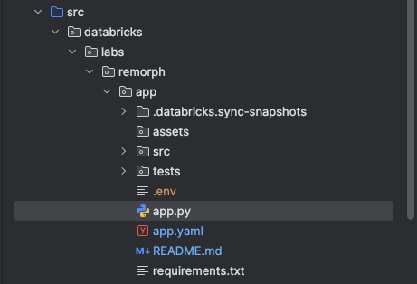
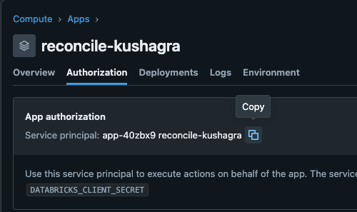
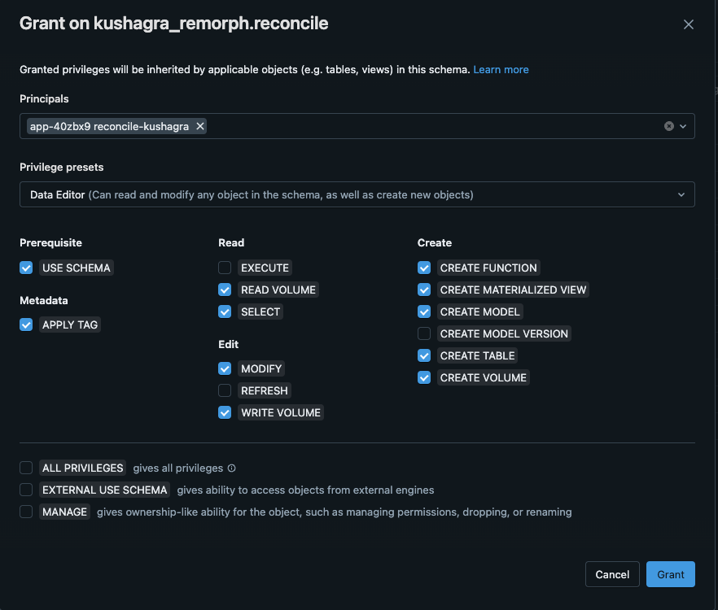

# Pre requisites:

1. Setup the CLI.
2. Clone the Remorph repo
3. Checkout feature/reconcile-databricks-app
4. Open app.yaml in the app module

5. Update the REMORPH_METADATA_SCHEMA value with your Remorph reconcile schema (Use the same schema you used while installing Remorph).
6. If you dont have remorph, feel free to use any other <catalog.schema> where you have access.

# Steps to deploy app

1. Create the app

>> databricks apps create <reconcile-app-name>

2. Sync the app directory to local path and upload the files to Workspace.First navigate to app directory

>> cd src/databricks/labs/remorph/app/

Then, upload the app files to workspace. Do this in a new terminal tab an leave it open to sync.

>> databricks sync --watch . /Workspace/Users/user..name@databricks.com/ <reconcile-app-name>

3. Deploy the app

>> databricks apps deploy <reconcile-app-name>
--source-code-path  /Workspace/Users/user..name@databricks.com/ <reconcile-app-name>

# Fix permission issues
(TODO: Do this programmatically)

1. Copy service principle ID of your app. Goto Compute > Apps Your app > Authorization tab

2Provide this service principle access to your remorph Schema. Data editor access should be fine:

Once done, launch the app and you should see a message that some tables have been created. If yes then app is successfully deployed.

